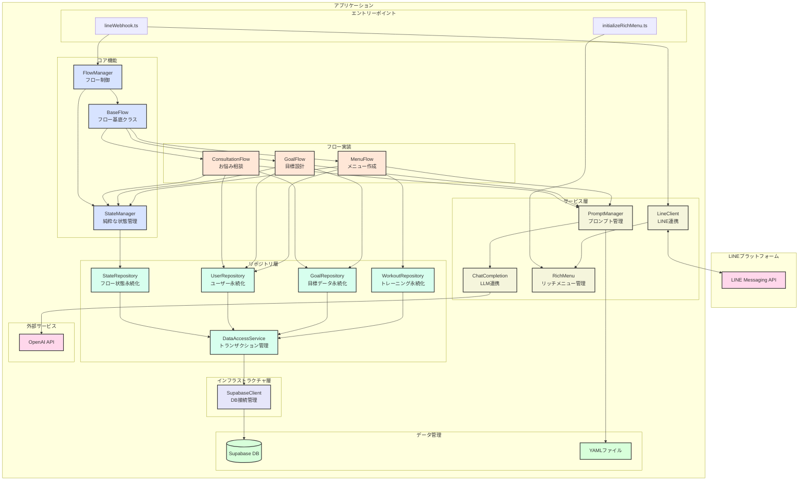
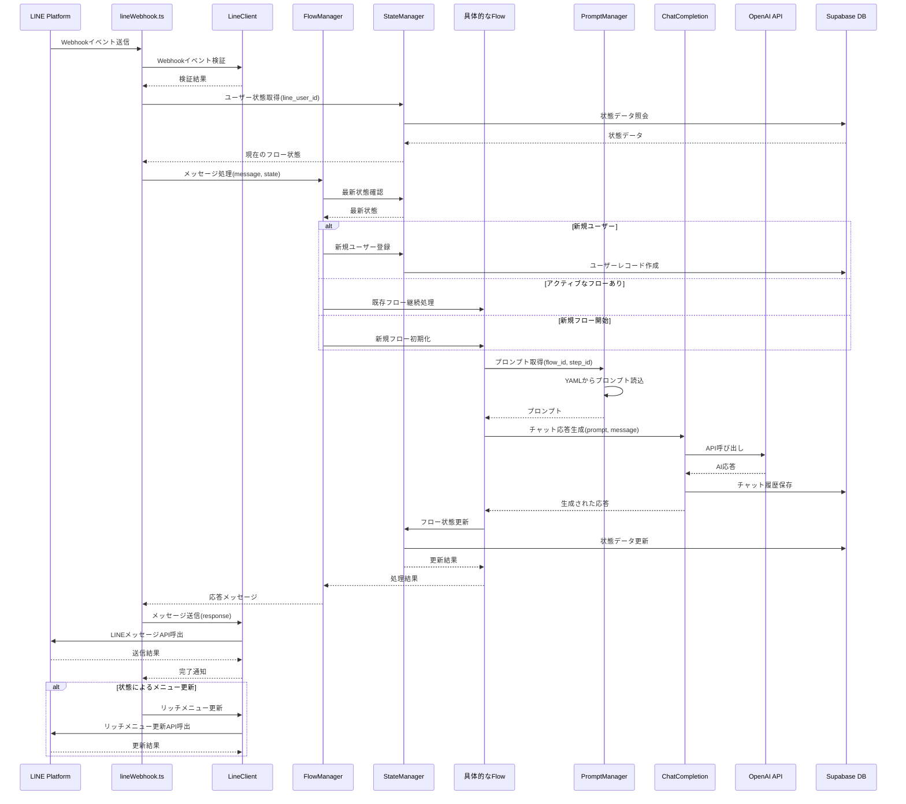
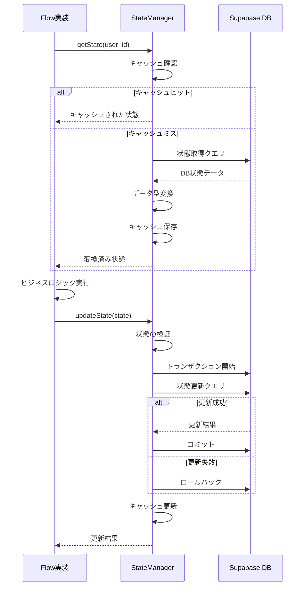

# ヘルスケアLINEシステムアーキテクチャ

## 1. システム概要

このシステムは、LINE Messaging APIを利用したフィットネス初心者向けのAIトレーナーBOTです。ユーザーのLINEアカウントを通じて健康相談を受け付け、AIによる回答生成、目標設定、トレーニングメニュー作成などをサポートします。

## 2. システム構成図



## 3. 主要コンポーネント

### 3.1 エントリーポイント

- **lineWebhook.ts**: LINEからのWebhookを受け取り、ユーザーメッセージを処理するエントリーポイント
- **initializeRichMenu.ts**: リッチメニューの初期化を行うAPI

### 3.2 コア機能

- **StateManager**: ユーザー状態管理を専門に担当するモジュール
  - ユーザー状態のCRUD操作
  - 状態の永続化と取得
  - 状態遷移の検証
  - トランザクション管理
  - エラーハンドリング

- **FlowManager**: フロー全体の制御を担当
  - フローの振り分け
  - フロー間の遷移管理
  - 全体のライフサイクル管理

- **BaseFlow**: フロー基底クラス
  - 共通フロー機能の定義
  - 基本的なフロー制御メソッド
  - エラーハンドリング
  - ライフサイクルフック

### 3.3 フロー実装

- **ConsultationFlow**: お悩み相談フロー
  - 健康相談の受付と分析
  - アドバイス生成
  - 目標設定フローへの誘導

- **GoalFlow**: 目標設計フロー
  - 現状分析
  - 目標設定支援
  - 行動計画の作成

- **MenuFlow**: メニュー作成フロー
  - トレーニングメニューの生成
  - 進捗管理
  - メニュー調整

### 3.4 サービス層

- **PromptManager**: プロンプト管理サービス
  - YAMLベースのプロンプト管理
  - コンテキストの注入
  - プロンプトのバージョン管理

- **ChatCompletion**: LLM連携サービス
  - OpenAI APIとの通信
  - エラーハンドリング
  - レスポンス品質管理

- **RichMenu**: リッチメニュー管理サービス
  - LINE リッチメニューの動的管理
  - ユーザー状態に応じたメニュー切り替え
  - メニューイベントのハンドリング

- **LineClient**: LINE連携サービス
  - LINEクライアントの初期化
  - Webhookの検証
  - メッセージ送信

## 4. データモデル

### 4.1 主要テーブル

- **users**: ユーザー基本情報
- **goals**: ユーザーの設定目標
- **workouts**: 運動実施ログ
- **chat_logs**: 対話履歴
- **progress**: 日々の体組成記録
- **flow_states**: フロー状態管理
- **flow_history**: フロー遷移履歴

### 4.2 YAMLファイル

- **RDD.yaml**: プロジェクトの要件定義とデータベース設計
- **structure.yaml**: プロジェクトのディレクトリ・ファイル構造定義
- **flows/**: フロー定義ファイル
- **prompts/**: プロンプト定義ファイル

## 5. データフロー

1. **ユーザーからのメッセージ受信フロー**:
   - LINE → Webhook → StateManagerによる状態取得 → FlowManagerによるフロー選択 → 適切なフロー実行 → プロンプト生成 → OpenAI API → レスポンス生成 → LINE

2. **状態管理フロー**:
   - フロー実行 → StateManagerによる状態更新 → Supabase DB

3. **リッチメニュー更新フロー**:
   - ユーザー状態変化 → FlowManager通知 → RichMenu更新 → LINE

### 5.1 メッセージ処理シーケンス図

以下のシーケンス図は、ユーザーメッセージ受信から応答までの詳細なフローを示しています：



### 5.2 状態管理シーケンス図

以下は状態管理の詳細なフローを示します：



## 6. 責務分離パターン

システムは以下の原則に基づいて責務を分離しています：

1. **単一責任の原則**: 各モジュールは明確に定義された単一の責任を持つ
   - StateManagerは状態管理のみを担当
   - FlowManagerはフロー選択と遷移のみを担当
   - 各フローは独自のロジックを担当

2. **依存性逆転の原則**: 高レベルモジュールは低レベルモジュールに依存しない
   - FlowManagerはStateManagerに依存するが、具体的なフロー実装には依存しない
   - BaseFlowを介して依存関係を抽象化

3. **関心の分離**: ビジネスロジック、データアクセス、UIの分離
   - フロー実装はビジネスロジックに集中
   - データアクセスはStateManagerとSupabaseClientに集約
   - UI（LINE対応）はLineClientに集約

## 7. 拡張性と保守性

本アーキテクチャは以下の特徴により高い拡張性と保守性を実現しています：

1. **モジュール化**: 明確に分離されたモジュール構造
2. **プラグイン的なフロー追加**: BaseFlowを継承することで新しいフローを容易に追加可能
3. **設定の外部化**: YAMLファイルによるプロンプトとフロー定義
4. **型システムの整理**: 型定義の集約による型安全性の向上
5. **テスト容易性**: モジュール分離によるテスト容易性の向上

## 8. ディレクトリ構造

プロジェクトのディレクトリ構造は以下の通りです：

```
/
├── RDD.yaml                    # プロジェクトの要件定義とデータベース設計
├── structure.yaml              # プロジェクトのディレクトリ・ファイル構造定義
├── healthcare.yaml             # プロジェクト固有の設定
├── package.json                # 依存関係の管理
├── tsconfig.json               # TypeScriptの設定
├── .env.local                  # 環境変数
│
├── pages/                      # Next.jsのページディレクトリ
│   └── api/                    # APIエンドポイント
│       ├── lineWebhook.ts      # LINEのWebhookエンドポイント
│       └── initializeRichMenu.ts # リッチメニュー初期化API
│
├── lib/                        # ライブラリコード
│   ├── core/                   # コア機能
│   │   ├── stateManager.ts     # 状態管理
│   │   ├── baseFlow.ts         # フロー基底クラス
│   │   └── flowManager.ts      # フロー管理（現在のルートに）
│   │
│   ├── types/                  # 型定義
│   │   ├── state.ts            # 状態関連の型定義
│   │   ├── flow.ts             # フロー関連の型定義
│   │   ├── prompt.ts           # プロンプト関連の型定義
│   │   ├── chat.ts             # チャット関連の型定義
│   │   ├── menu.ts             # メニュー関連の型定義
│   │   ├── line.ts             # LINE関連の型定義
│   │   └── database.ts         # データベース関連の型定義
│   │
│   ├── services/               # 外部サービス連携
│   │   ├── promptManager.ts    # プロンプト管理
│   │   ├── chatCompletion.ts   # OpenAI API連携
│   │   ├── richMenu.ts         # リッチメニュー管理
│   │   ├── lineClient.ts       # LINE連携
│   │   └── supabaseClient.ts   # Supabase連携
│   │
│   ├── utils/                  # ユーティリティ
│   │   ├── logger.ts           # ロギングユーティリティ
│   │   └── validator.ts        # バリデーションユーティリティ
│   │
│   ├── chatCompletion.ts       # LLM連携（現在のルートに）
│   ├── promptManager.ts        # プロンプト管理（現在のルートに）
│   ├── richMenu.ts             # リッチメニュー管理（現在のルートに）
│   ├── lineClient.ts           # LINE連携（現在のルートに）
│   ├── supabaseClient.ts       # Supabase連携（現在のルートに）
│   └── types.ts                # 型定義エクスポート
│
├── flows/                      # フロー定義YAMLファイル
│   ├── consultation_flow.yaml  # お悩み相談フロー定義
│   └── goal_setting_flow.yaml  # 目標設計フロー定義
│
├── prompts/                    # プロンプト定義YAMLファイル
│   ├── consultation.yaml       # お悩み相談プロンプト
│   ├── shared.yaml             # 共有プロンプト
│   └── shared/                 # 共有プロンプトディレクトリ
│       └── goal_transition.yaml # 目標遷移プロンプト
│
├── migrations/                 # データベースマイグレーション
│   ├── chat_logs.sql           # チャットログテーブルの作成
│   ├── add_metadata_to_chat_logs.sql # メタデータ追加マイグレーション
│   └── flow_states.sql         # フロー状態テーブル作成
│
├── scripts/                    # スクリプト
│   └── initializeRichMenu.ts   # リッチメニュー初期化スクリプト
│
├── __tests__/                  # テスト
│   ├── lib/                    # ライブラリのテスト
│   │   ├── core/               # コア機能のテスト
│   │   │   ├── stateManager.test.ts
│   │   │   ├── flowManager.test.ts
│   │   │   └── baseFlow.test.ts
│   │   │
│   │   ├── flows/              # フロー実装のテスト
│   │   │   ├── consultationFlow.test.ts
│   │   │   ├── goalSettingFlow.test.ts
│   │   │   └── dailyMenuFlow.test.ts
│   │   │
│   │   └── services/           # サービスのテスト
│   │       ├── promptManager.test.ts
│   │       ├── chatCompletion.test.ts
│   │       ├── richMenu.test.ts
│   │       └── lineClient.test.ts
│   │
│   ├── integration/            # 統合テスト
│   │   ├── flow-state/         # フロー状態テスト
│   │   ├── ai-integration/     # AI連携テスト
│   │   └── line-integration/   # LINE連携テスト
│   │
│   ├── e2e/                    # エンドツーエンドテスト
│   │   └── scenarios/          # シナリオテスト
│   │
│   └── __mocks__/              # モック定義
│       ├── lib/                # ライブラリモック
│       │   ├── core/           # コアモック
│       │   │   ├── stateManager.ts
│       │   │   └── baseFlow.ts
│       │   │
│       │   └── services/       # サービスモック
│       │       ├── database.ts
│       │       ├── lineClient.ts
│       │       └── promptManager.ts
│       │
│       └── external/           # 外部依存モック
│           ├── line-bot-sdk.ts
│           └── openai.ts
│
├── docs/                       # ドキュメント
│   ├── flows/                  # フロー図
│   │   ├── consultation.md
│   │   ├── goal_setting.md
│   │   ├── data_processing.md
│   │   └── notification.md
│   │
│   └── apis/                   # API仕様
│
└── supabase/                   # Supabase関連
```

## 9. テスト構造

テスト構造は以下のように階層化されています：

### 9.1 単体テスト

コンポーネント単位のテストを実施します。

- **コアテスト**: `__tests__/lib/core/`
  - `stateManager.test.ts`: 状態管理の単体テスト
  - `flowManager.test.ts`: フロー管理の単体テスト
  - `baseFlow.test.ts`: 基底フローの単体テスト

- **フローテスト**: `__tests__/lib/flows/`
  - `consultationFlow.test.ts`: お悩み相談フローの単体テスト
  - `goalSettingFlow.test.ts`: 目標設定フローの単体テスト
  - `dailyMenuFlow.test.ts`: デイリーメニューフローの単体テスト

- **サービステスト**: `__tests__/lib/services/`
  - `promptManager.test.ts`: プロンプト管理の単体テスト
  - `chatCompletion.test.ts`: LLM連携の単体テスト
  - `richMenu.test.ts`: リッチメニュー管理の単体テスト
  - `lineClient.test.ts`: LINE連携の単体テスト

### 9.2 統合テスト

コンポーネント間の連携をテストします。

- **フロー状態テスト**: `__tests__/integration/flow-state/`
  - フロー制御と状態管理の統合テスト

- **AI連携テスト**: `__tests__/integration/ai-integration/`
  - プロンプト管理とLLM連携の統合テスト

- **LINE連携テスト**: `__tests__/integration/line-integration/`
  - LINEクライアントとリッチメニュー連携の統合テスト

### 9.3 エンドツーエンドテスト

システム全体をテストします。

- **シナリオテスト**: `__tests__/e2e/scenarios/`
  - 実際のユーザーシナリオを模したテスト

### 9.4 モック

テスト用のモック定義を管理します。

- **ライブラリモック**: `__tests__/__mocks__/lib/`
  - コアモック: `__tests__/__mocks__/lib/core/`
  - サービスモック: `__tests__/__mocks__/lib/services/`

- **外部依存モック**: `__tests__/__mocks__/external/`
  - LINE Bot SDKのモック: `__tests__/__mocks__/external/line-bot-sdk.ts`
  - OpenAI APIのモック: `__tests__/__mocks__/external/openai.ts`

## 10. 新規フロー追加手順

新しいフローを追加する手順は以下の通りです：

1. **YAMLファイルの作成**:
   - `flows/` ディレクトリに新しいフロー定義YAMLファイルを作成
   - `prompts/` ディレクトリに対応するプロンプト定義を作成

2. **フロークラスの実装**:
   - `lib/flows/` ディレクトリに新しいフロークラスを作成
   - `BaseFlow` クラスを継承し、必要なメソッドをオーバーライド

3. **テストの作成**:
   - 単体テストを `__tests__/lib/flows/` に作成
   - 必要に応じて統合テストも追加

4. **フローマネージャーの更新**:
   - `FlowManager` に新しいフローの登録処理を追加 