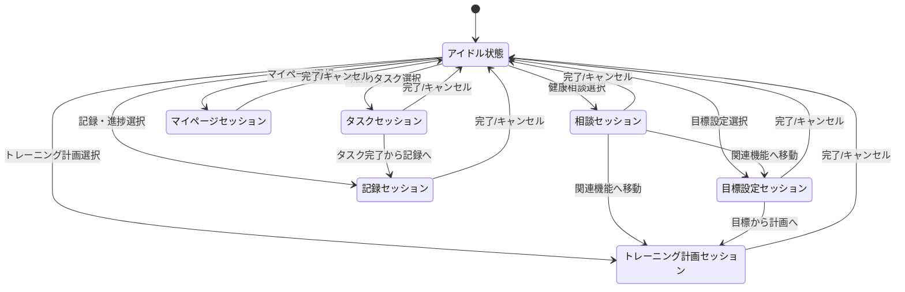
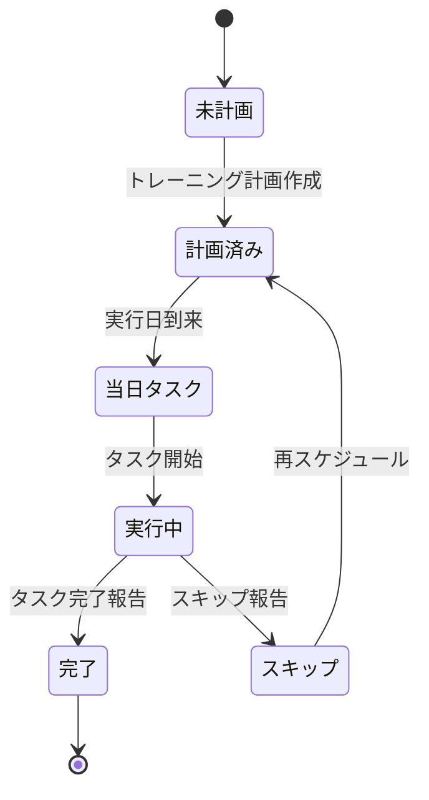
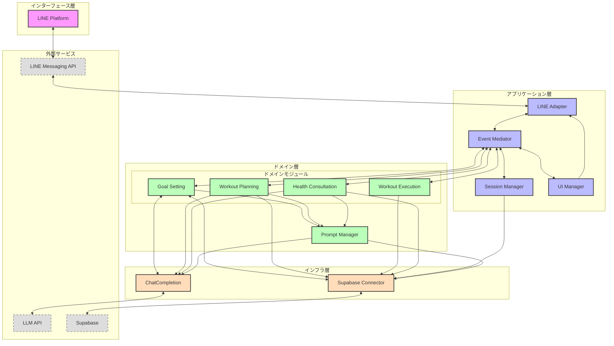
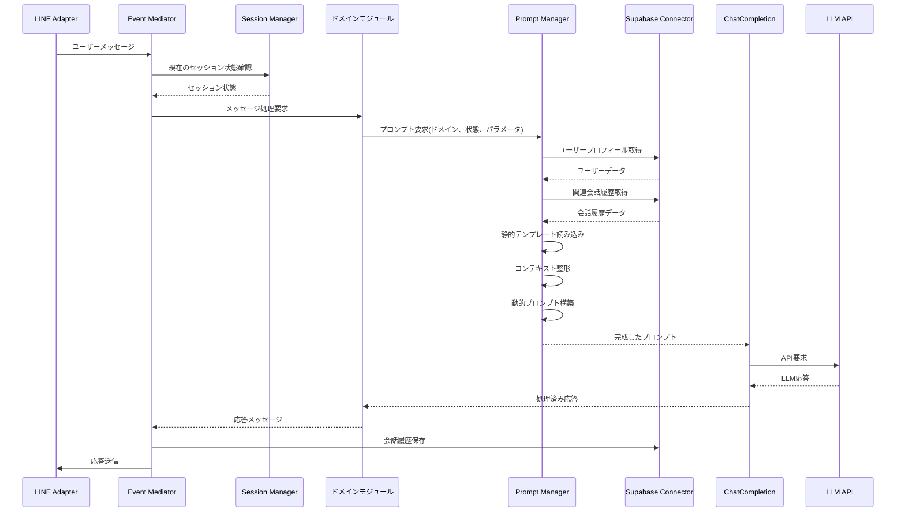
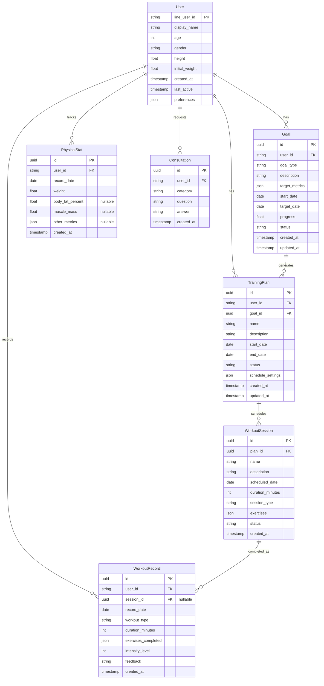

# LINEフィットネスBOT要件定義書

## 1. サービス概要・目的定義

### サービスコンセプト
LINEフィットネスBOTは、LINEプラットフォーム上で動作するパーソナルヘルスケアアシスタントです。日常的に使用するLINEという親しみやすいインターフェースを通じて、ユーザーの健康維持・増進とフィットネス目標達成をサポートします。AIを活用した個別化されたアドバイスと継続的なモチベーション管理により、ユーザーのフィットネスジャーニーを総合的にサポートします。

### 提供価値
- **アクセシビリティ**: 特別なアプリダウンロードなく、日常的に使用するLINEで簡単にフィットネス管理が可能
- **パーソナライズ**: LLMを活用した個別化された目標設定とトレーニング計画の提案
- **継続性**: モチベーション維持のための定期的なリマインドと達成度の可視化
- **一貫性**: トレーニング記録の一元管理と進捗トラッキング
- **専門性**: 健康・フィットネスに関する専門的なアドバイスの提供

### ターゲットユーザー
- フィットネス習慣の形成・維持に興味があるが、複雑なアプリの使用や専門ジムへの通いに抵抗感がある方
- 日常生活の中で手軽に健康管理をしたい働き盛りの社会人
- フィットネス初心者で、どのように始めるべきか迷っている方
- すでに運動習慣があるが、より効率的・効果的なトレーニング方法を求めている方
- 健康に関する悩みや質問があり、専門的なアドバイスを求めている方 

## 2. サービス全体構造

### リッチメニュー中心のUI設計
LINEフィットネスBOTは、リッチメニューを中心としたUI設計を採用します。ユーザーがBOTとの対話を開始すると、常に6つの主要機能にアクセスできるリッチメニューが表示されます。このリッチメニュー中心設計により、ユーザーは直感的に必要な機能にアクセスでき、サービス全体の利便性が向上します。

#### リッチメニュー構成
1. **目標設定**: ユーザーの健康・フィットネス目標を設定する機能
2. **トレーニング計画**: 目標に基づいたトレーニングプランを作成・管理する機能
3. **記録・進捗**: トレーニング実績や身体状況の変化を記録・可視化する機能
4. **健康相談**: 健康やフィットネスに関する質問に回答する機能
5. **今日のタスク**: その日に実行すべきトレーニングや健康活動を表示する機能
6. **マイページ**: ユーザー情報や設定を管理する機能

### 主要機能マップ

```
LINEフィットネスBOT
│
├── 目標設定
│   ├── 初期目標設定ウィザード
│   ├── 目標修正・更新
│   └── 目標達成度確認
│
├── トレーニング計画
│   ├── プラン自動生成
│   ├── プランカスタマイズ
│   └── スケジュール管理
│
├── 記録・進捗
│   ├── トレーニング記録
│   ├── 身体指標記録
│   └── 進捗グラフ・分析
│
├── 健康相談
│   ├── トレーニング相談
│   ├── 食事・栄養相談
│   └── 体調相談
│
├── 今日のタスク
│   ├── 当日トレーニング表示
│   ├── タスク完了確認
│   └── リマインド設定
│
└── マイページ
    ├── プロフィール管理
    ├── 通知設定
    └── データエクスポート
```

### 機能間連携概要

各機能は独立して利用可能ですが、最適な体験を提供するために相互に連携します。

1. **目標設定 → トレーニング計画**
   - 設定された目標に基づいて最適なトレーニングプランを自動生成

2. **トレーニング計画 → 今日のタスク**
   - 作成されたトレーニングプランから当日のタスクを自動抽出

3. **今日のタスク → 記録・進捗**
   - 完了したタスクが自動的に記録され、進捗状況に反映

4. **記録・進捗 → 目標設定**
   - 進捗状況に基づいて目標の調整を推奨

5. **健康相談 → 全機能**
   - 相談内容に応じて各機能へのナビゲーションを提供

6. **マイページ → 全機能**
   - ユーザー情報を全機能で活用し、パーソナライズされた体験を提供 

## 3. ユーザーフロー設計

### リッチメニューからの各機能フロー

#### 1. 目標設定フロー
```
リッチメニュー「目標設定」
↓
初期健康状態確認
↓
対話型目標設定プロセス
 - ユーザーの漠然とした希望から具体的な目標への言語化支援
 - SMARTフレームワークを活用した目標の最適化
 - 実現可能性と継続性の確保
↓
目標の確認・承認
↓
データベースへの保存
↓
トレーニング計画への誘導
```

**目標設定における対話型アプローチ**

LLMを活用し、ユーザーの漠然とした希望をSMARTな目標へと変換します。科学的根拠と個人の制約を考慮しながら、実行可能で測定可能な目標を共同設計します。設定した目標はデータベースに保存され、トレーニング計画の基盤となります。

#### 2. トレーニング計画フロー
```
リッチメニュー「トレーニング計画」
↓
選択画面（新規作成/既存プラン確認/プラン修正）
↓
[新規作成選択時]
 ↓
 目標連携確認
 ↓
 トレーニング環境選択（自宅/ジム/屋外など）
 ↓
 週間トレーニング頻度設定
 ↓
 時間帯・所要時間設定
 ↓
 プラン自動生成
 ↓
 確認・カスタマイズ画面
 ↓
 プラン確定・スケジュール登録
```

#### 3. 記録・進捗フロー
```
リッチメニュー「記録・進捗」
↓
記録種類選択（トレーニング/身体指標/食事など）
↓
[トレーニング記録選択時]
 ↓
 日付選択
 ↓
 実施メニュー表示・実績入力
 ↓
 コメント・感想入力（任意）
 ↓
 記録完了・フィードバック表示
 ↓
 進捗グラフ表示
```

#### 4. 健康相談フロー
```
リッチメニュー「健康相談」
↓
相談カテゴリ選択（運動/栄養/体調/その他）
↓
質問自由入力
↓
AIによる回答生成
↓
フォローアップ質問（必要に応じて）
↓
関連機能へのナビゲーション提案
```

#### 5. 今日のタスクフロー
```
リッチメニュー「今日のタスク」
↓
当日タスク一覧表示
↓
タスク選択
↓
詳細表示（手順/注意点など）
↓
実行確認
↓
完了報告
↓
次のタスク案内または全タスク完了祝福
```

#### 6. マイページフロー
```
リッチメニュー「マイページ」
↓
セクション選択（プロフィール/設定/データ/お知らせなど）
↓
[プロフィール選択時]
 ↓
 登録情報確認
 ↓
 編集項目選択
 ↓
 情報更新
 ↓
 保存完了
```

### 主要会話シナリオ

#### 初回利用シナリオ
```
ユーザー: BOTを友だち追加
BOT: ウェルカムメッセージ表示
     ↓
BOT: サービス概要説明
     ↓
BOT: 初期プロフィール設定ガイド
     ↓
ユーザー: 基本情報入力（性別/年齢/身長/体重）
     ↓
BOT: 目標設定ウィザード案内
     ↓
ユーザー: 目標設定
     ↓
BOT: 初期トレーニングプラン提案
     ↓
BOT: リッチメニュー操作説明
```

#### 日常利用シナリオ
```
BOT: 朝のリマインド通知
     ↓
ユーザー: リッチメニュー「今日のタスク」タップ
     ↓
BOT: 当日予定タスク表示
     ↓
ユーザー: タスク実行後、完了報告
     ↓
BOT: 完了確認・褒める・記録
     ↓
BOT: 進捗状況更新通知
     ↓
ユーザー: リッチメニュー「記録・進捗」タップ
     ↓
BOT: 進捗グラフ表示・フィードバック
```

### 状態遷移図

#### ユーザーセッション状態遷移


#### タスク状態遷移


これらのフローと状態遷移図は、BOTの動作設計とユーザーとのインタラクションパターンを明確化し、開発時の指針となります。また、各状態でのエラーハンドリングや例外処理についても、実装段階で詳細に定義します。 

## 4. 詳細機能要件

このセクションでは、各リッチメニュー項目に紐づく機能の詳細と優先度を定義します。

### 4.1 目標設定機能

| 機能ID | 機能名 | 説明 | 優先度 |
|--------|--------|------|--------|
| G-01 | 初期目標設定 | ユーザーの初回利用時に、対話型プロセスでSMARTな目標を設定する | 高 |
| G-02 | 目標修正 | 既存の目標を見直し、進捗や状況に応じて調整する | 中 |
| G-03 | 目標一覧表示 | 設定した目標とその進捗状況を一覧表示する | 中 |
| G-04 | 目標達成度確認 | 現在の進捗状況と目標達成度を可視化する | 中 |
| G-05 | サブ目標自動生成 | 主要目標から週次・月次のサブ目標を自動生成する | 低 |

**データ要件**
- 目標タイプ（筋力向上/減量/持久力向上など）
- 開始数値と目標数値（体重/筋力/距離など）
- 期限・タイムフレーム
- 制約条件（利用可能時間/環境/既往歴など）
- 進捗履歴

### 4.2 トレーニング計画機能

| 機能ID | 機能名 | 説明 | 優先度 |
|--------|--------|------|--------|
| T-01 | プラン自動生成 | 設定された目標に基づいて最適なトレーニングプランを生成する | 高 |
| T-02 | プランカスタマイズ | 生成されたプランをユーザー要望に応じて調整する | 高 |
| T-03 | スケジュール管理 | トレーニングの曜日・時間設定と管理を行う | 高 |
| T-04 | トレーニング詳細表示 | 各トレーニングの実施方法・注意点の詳細説明を提供する | 中 |
| T-05 | 代替トレーニング提案 | 条件変更時に適切な代替メニューを提案する | 中 |
| T-06 | 進捗に応じた強度調整 | 記録データに基づいてトレーニング強度を自動調整する | 低 |

**データ要件**
- トレーニングタイプ（筋トレ/有酸素/柔軟性/バランスなど）
- 頻度・セット数・回数などの詳細
- 実施スケジュール
- 必要な器具・環境
- 難易度・強度レベル

### 4.3 記録・進捗機能

| 機能ID | 機能名 | 説明 | 優先度 |
|--------|--------|------|--------|
| R-01 | トレーニング記録 | 実施したトレーニングの詳細を記録する | 高 |
| R-02 | 身体指標記録 | 体重・体脂肪率・筋肉量などの身体指標を記録する | 高 |
| R-03 | 進捗グラフ表示 | 記録データをグラフ化して視覚的に進捗を表示する | 中 |
| R-04 | 進捗分析 | トレンド分析と目標達成予測を提供する | 中 |
| R-05 | 記録リマインダー | 定期的な記録入力を促すリマインド通知を送信する | 中 |
| R-06 | アチーブメント機能 | 特定のマイルストーン達成時に表彰・祝福する | 低 |

**データ要件**
- トレーニング実績（種類/セット数/回数/時間など）
- 身体測定値の時系列データ
- 主観的評価（疲労度/満足度など）
- タイムスタンプ情報

### 4.4 健康相談機能

| 機能ID | 機能名 | 説明 | 優先度 |
|--------|--------|------|--------|
| C-01 | トレーニング相談 | 運動方法や効果に関する質問に回答する | 高 |
| C-02 | 栄養・食事相談 | 食事や栄養摂取に関するアドバイスを提供する | 高 |
| C-03 | 体調相談 | 体調不良やケガへの対応アドバイスを提供する | 中 |
| C-04 | モチベーション相談 | モチベーション維持のためのサポートを提供する | 中 |
| C-05 | 相談履歴表示 | 過去の相談内容と回答を閲覧できる | 低 |

**実装アプローチ**
健康相談機能は、上記のように分類していますが、内部的にはすべての相談カテゴリにおいてLLMを活用した回答自動生成システムを採用します。カテゴリ分けは主にLLMのプロンプト設計とコンテキスト設定のためのものであり、ユーザーインターフェース上での分類として機能します。

**データ要件**
- 相談カテゴリ（プロンプト選択のための分類情報）
- 質問内容
- LLMへの入力プロンプト設定
- 回答内容（LLMからの生成結果）
- 相談履歴・コンテキスト情報
- フォローアップ情報

### 4.5 今日のタスク機能

| 機能ID | 機能名 | 説明 | 優先度 |
|--------|--------|------|--------|
| D-01 | 当日タスク表示 | その日実行すべきトレーニングを表示する | 高 |
| D-02 | タスク完了確認 | タスクの完了報告と記録を行う | 高 |
| D-03 | タスクリマインド | 未実行タスクのリマインド通知を送信する | 中 |
| D-04 | クイック記録 | 簡易的なタスク実行記録を行う | 中 |
| D-05 | タスク調整 | 当日の状況に応じたタスク調整を行う | 中 |

**データ要件**
- 当日のタスクリスト
- タスクステータス（予定/完了/スキップ）
- 完了時刻
- 実行フィードバック

### 4.6 マイページ機能

| 機能ID | 機能名 | 説明 | 優先度 |
|--------|--------|------|--------|
| M-01 | プロフィール管理 | ユーザーの基本情報を管理する | 高 |
| M-02 | 通知設定 | リマインドなどの通知設定を管理する | 中 |
| M-03 | アカウント連携 | 他の健康アプリとの連携設定を管理する（将来拡張） | 低 |
| M-04 | データエクスポート | 記録データのエクスポート機能を提供する | 低 |
| M-05 | サポート・問い合わせ | ヘルプ情報の表示と問い合わせ機能を提供する | 中 |

**データ要件**
- ユーザープロフィール情報
- アプリ設定情報
- 通知設定
- 連携アカウント情報

### 4.7 優先実装機能（MVP）

最初のリリースでは、以下の機能を優先的に実装します：

1. **目標設定基本機能** (G-01)
2. **基本的なトレーニング計画作成** (T-01, T-02, T-03)
3. **シンプルな記録機能** (R-01, R-02)
4. **基本的な健康相談対応** (C-01, C-02)
5. **今日のタスク表示と完了確認** (D-01, D-02)
6. **基本的なユーザープロフィール管理** (M-01)

これらの機能で最小限の価値提供が可能なサービスを構築し、ユーザーフィードバックを得ながら段階的に拡張していきます。 

## 5. 技術アーキテクチャ

### 5.1 システム構成図



### 5.1 プロンプト管理のデータフロー

LINEフィットネスBOTでは、プロンプト管理と会話履歴の処理を以下のように実装します：

#### 会話履歴管理とプロンプト生成フロー



この設計では、各コンポーネントの責務を明確に分離しています：

- **Event Mediator**: イベントのルーティングと全体フロー制御
- **Session Manager**: ユーザーごとの現在の状態（ステート）管理
- **Supabase Connector**: 会話履歴の保存と取得を担当
- **Prompt Manager**: テンプレート管理とプロンプト構築に特化

この分離により、会話履歴は「データ」として扱われ、Supabaseに永続化されます。プロンプト構築時に必要な会話履歴はDBから取得され、LLMへの入力として整形されます。

### 5.2 アーキテクチャコンセプト

LINEフィットネスBOTは、**イベント駆動型**かつ**ドメイン中心**のアーキテクチャを採用します。LINEの会話型UIは状態遷移が非同期的に発生するため、このアーキテクチャが最適です。

#### 主要コンポーネント

1. **Event Mediator (イベント調停者)**
   - すべてのイベント（メッセージ、ボタン操作、タイマーなど）のルーティングを担当
   - ドメイン間の連携を疎結合に保ち、整合性を確保
   - 複雑なイベントフローのオーケストレーション

2. **Session Manager (セッション管理)**
   - ユーザーごとの現在の状態（ステート）管理
   - 状態遷移の処理と監視
   - 会話の進行状況の追跡
   - セッションタイムアウト処理と状態復元

3. **Prompt Manager (プロンプト管理)**
   - プロンプトテンプレートの管理と提供
   - ユーザーコンテキストとテンプレートの組み合わせ
   - 会話履歴データの取得と整形
   - 動的プロンプト生成

4. **UI Manager (表示管理)**
   - LINEメッセージタイプの抽象化
   - 状態に応じた適切なUIコンポーネント選択
   - インタラクションパターンのテンプレート化

5. **LINE Adapter (LINE連携)**
   - LINE Messaging APIとの通信処理
   - メッセージの送受信と変換
   - Webhookイベントの処理

6. **Supabase Connector (データベース連携)**
   - データの永続化と取得
   - 会話履歴の保存と管理
   - ユーザープロフィールやコンテキスト情報の管理

### 5.3 LLM活用方針

LLMは以下の領域で活用します：

1. **目標設定支援**
   - ユーザーの自然言語入力からSMART目標への変換
   - 対話的な目標精緻化プロセスの実現
   - 適切な目標範囲の提案

2. **トレーニング計画生成**
   - 目標と制約条件に基づく最適なトレーニングプラン生成
   - ユーザー特性を考慮したカスタマイズ
   - 専門知識に基づく説明生成

3. **健康相談対応**
   - 幅広い健康・フィットネス質問への回答
   - ユーザーコンテキストを考慮した個別化アドバイス
   - 必要に応じた追加質問による情報収集

4. **自然言語インターフェース**
   - ユーザーの自由形式入力の意図理解
   - 適切な機能へのルーティング
   - 自然な会話の維持

#### LLMプロンプト設計の原則

- 各機能ドメインごとに専用のプロンプトテンプレートを用意
- ユーザーコンテキスト（プロフィール、過去の会話、目標など）を含める
- 制約条件（医学的知識の範囲、安全性への配慮など）を明示
- 適切な出力形式（構造化JSONなど）の指定
- フォールバックメカニズムの組み込み

### 5.4 データモデル



### 5.5 Supabase連携設計

Supabaseは以下の機能で活用します：

1. **データベース**
   - PostgreSQLベースのリレーショナルデータベース
   - 上記のデータモデルを実装
   - RLSによるセキュリティ確保

2. **認証**
   - LINE OAuthとの連携
   - ユーザー管理（匿名ユーザーを含む）

3. **リアルタイム機能**
   - データ変更のサブスクリプション
   - リマインド通知のトリガー

4. **Edge Functions**
   - 定期的なリマインド処理
   - バッチ処理（データ集計など）
   - LINE API連携の補助機能

#### データアクセスパターン

- **読み取り操作**：直接クエリまたはRPC呼び出し
- **書き込み操作**：直接クエリまたはRPC呼び出し
- **バッチ処理**：Edge Functionsによる実行

### 5.6 セキュリティ設計

1. **認証・認可**
   - LINE認証に基づくユーザー識別
   - Row Level Security (RLS)によるデータアクセス制御
   - 最小権限の原則に基づくアクセス設計

2. **データ保護**
   - 機密情報の暗号化保存
   - HTTPSによる通信暗号化
   - 保存データの定期的なバックアップ

3. **外部サービス連携**
   - API keyの安全な管理
   - サーバー側での認証処理
   - レート制限の設定

4. **コンプライアンス**
   - 個人情報保護法への対応
   - プライバシーポリシーの明確化
   - 利用規約の整備