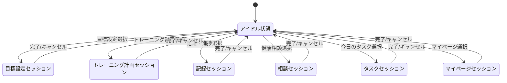

# LINEフィットネスBOT要件定義書

## 1. サービス概要・目的定義

### サービスコンセプト
LINEフィットネスBOTは、LINEプラットフォーム上で動作するパーソナルヘルスケアアシスタントです。日常的に使用するLINEという親しみやすいインターフェースを通じて、ユーザーの健康維持・増進とフィットネス目標達成をサポートします。AIを活用した個別化されたアドバイスと継続的なモチベーション管理により、ユーザーのフィットネスジャーニーを総合的にサポートします。

### 提供価値
- **アクセシビリティ**: 特別なアプリダウンロードなく、日常的に使用するLINEで簡単にフィットネス管理が可能
- **パーソナライズ**: LLMを活用した個別化された目標設定とトレーニング計画の提案
- **継続性**: モチベーション維持のための定期的なリマインドと達成度の可視化
- **一貫性**: トレーニング記録の一元管理と進捗トラッキング
- **専門性**: 健康・フィットネスに関する専門的なアドバイスの提供

### ターゲットユーザー
- フィットネス習慣の形成・維持に興味があるが、複雑なアプリの使用や専門ジムへの通いに抵抗感がある方
- 日常生活の中で手軽に健康管理をしたい働き盛りの社会人
- フィットネス初心者で、どのように始めるべきか迷っている方
- すでに運動習慣があるが、より効率的・効果的なトレーニング方法を求めている方
- 健康に関する悩みや質問があり、専門的なアドバイスを求めている方 

## 2. サービス全体構造

### リッチメニュー中心のUI設計
LINEフィットネスBOTは、リッチメニューを中心としたUI設計を採用します。
ユーザーの状態（初期設定未完了、トレーニング中など）に応じてリッチメニューを動的に切り替え、その時点で最適なアクションを提示します（例: 初期設定未完了ユーザーには「目標設定」を目立たせるなど）。

基本となるメインメニューでは、以下の6つの主要機能にアクセスできます。

#### リッチメニュー構成
1. **目標設定**: ユーザーの健康・フィットネス目標を設定する機能
2. **トレーニング計画**: 目標に基づいたトレーニングプランを作成・管理する機能
3. **記録・進捗**: トレーニング実績や身体状況の変化を記録・可視化する機能
4. **健康相談**: 健康やフィットネスに関する質問に回答する機能
5. **今日のタスク**: その日に実行すべきトレーニングや健康活動を表示する機能
6. **マイページ**: ユーザー情報や設定を管理する機能

### 主要機能マップ

```
LINEフィットネスBOT
│
├── 目標設定
│   ├── 初期目標設定ウィザード
│   ├── 目標修正・更新
│   └── 目標達成度確認
│
├── トレーニング計画
│   ├── プラン自動生成
│   ├── プランカスタマイズ
│   └── スケジュール管理
│
├── 記録・進捗
│   ├── トレーニング記録
│   ├── 身体指標記録
│   └── 進捗グラフ・分析
│
├── 健康相談
│   ├── トレーニング相談
│   ├── 食事・栄養相談
│   └── 体調相談
│
├── 今日のタスク
│   ├── 当日トレーニング表示
│   ├── タスク完了確認
│   └── リマインド設定
│
└── マイページ
    ├── プロフィール管理
    ├── 通知設定
    └── データエクスポート
```

## 3. ユーザーフロー設計

ユーザー体験の詳細は、以下の各ワークフロー設計書を参照してください。

- [目標設定フロー](../04_workflows/goal-setting.md)
- [トレーニング計画フロー](../04_workflows/training-plan.md)
- [記録・進捗フロー](../04_workflows/record-progress.md)
- [健康相談フロー](../04_workflows/health-consultation.md)
- [今日のタスクフロー](../04_workflows/todays-tasks.md)
- [マイページフロー](../04_workflows/mypage.md)

### 状態遷移図
ユーザーの状態管理（セッション）は、システム設計書のアーキテクチャ定義に基づき、以下のように遷移します。

#### ユーザーセッション状態遷移


## 4. 詳細機能要件

### 4.1 目標設定機能 (G-xx)
- **G-01 初期目標設定**: 対話型プロセスでSMARTな目標を設定 (優先度: 高)
- **G-02 目標修正**: 既存目標の調整 (優先度: 中)
- **G-03 目標一覧表示**: 目標と進捗の確認 (優先度: 中)

### 4.2 トレーニング計画機能 (T-xx)
- **T-01 プラン自動生成**: 目標に基づくプラン生成 (優先度: 高)
- **T-02 プランカスタマイズ**: 生成プランの調整 (優先度: 高)
- **T-03 スケジュール管理**: 実施曜日の設定 (優先度: 高)

### 4.3 記録・進捗機能 (R-xx)
- **R-01 トレーニング記録**: 実績の記録 (優先度: 高)
- **R-02 身体指標記録**: 体重・体脂肪等の記録 (優先度: 高)
- **R-03 進捗グラフ表示**: データの可視化 (優先度: 中)

### 4.4 健康相談機能 (C-xx)
- **C-01 トレーニング相談**: 運動に関する質問応答 (優先度: 高)
- **C-02 栄養・食事相談**: 食事アドバイス (優先度: 高)
- **LLM活用**: 全カテゴリでLLMによる自動応答を行う

### 4.5 今日のタスク機能 (D-xx)
- **D-01 当日タスク表示**: その日のメニュー表示 (優先度: 高)
- **D-02 タスク完了確認**: 完了報告と記録連携 (優先度: 高)
- **D-03 タスクリマインド**: 未実施タスクの通知 (優先度: 中)

### 4.6 マイページ機能 (M-xx)
- **M-01 プロフィール管理**: 基本情報の編集 (優先度: 高)
- **M-02 通知設定**: リマインド設定 (優先度: 中)

## 5. システム要件 & 技術スタック

詳細な技術設計は [システム設計書 (architecture.md)](../01_system_design/architecture.md) を参照してください。

### 5.1 技術スタック概要
- **プラットフォーム**: LINE Messaging API (LINE公式アカウント)
- **バックエンド**: Next.js (App Router) / Serverless Functions
- **データベース**: Supabase (PostgreSQL)
- **ORM**: Prisma (データアクセス・マイグレーション管理)
- **AI/LLM**: OpenAI API (GPT-4 class models)
- **インフラ**: Vercel (Hosting), Supabase (Backend-as-a-Service)

### 5.2 非機能要件
1.  **可用性**: 24時間365日稼働（メンテナンス時を除く）。LINEプラットフォームの稼働状況に依存。
2.  **応答性能**:
    - 通常のメニュー操作: 2秒以内
    - AI生成応答: ストリーミングまたはローディング表示を行い、ユーザーに待機感を与えないUXを提供する（目標: 10秒以内の応答開始）。
3.  **セキュリティ**:
    - 個人情報（身体データ等）は適切に保護されたDBに保存。
    - LINE IDと内部IDの紐付け管理による匿名性の確保。
4.  **拡張性**:
    - 新しいトレーニング種目や相談カテゴリの追加が容易なドメイン設計。

## 6. 今後のロードマップ
MVPリリース後は、以下の拡張を予定しています。
- LIFFアプリ導入による入力体験の向上
- 画像解析による食事管理機能
- ウェアラブルデバイス連携（Apple Health等）
