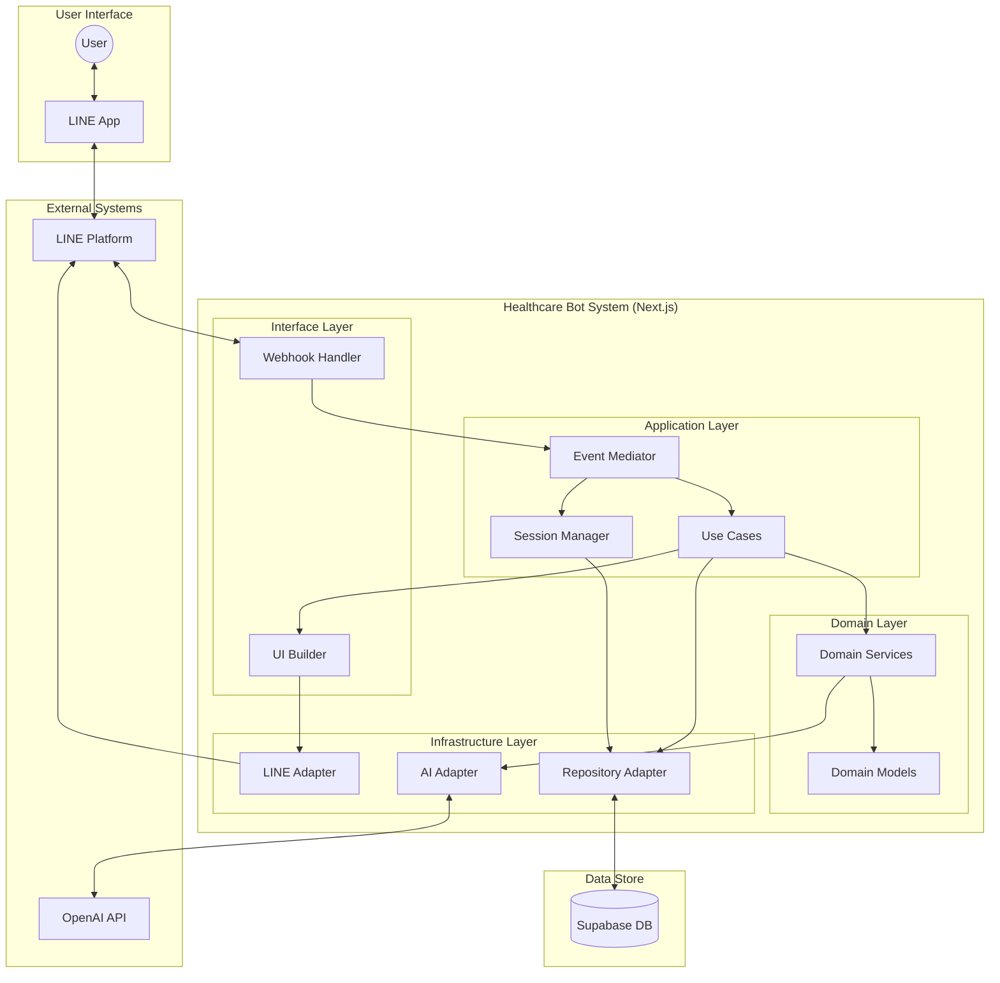
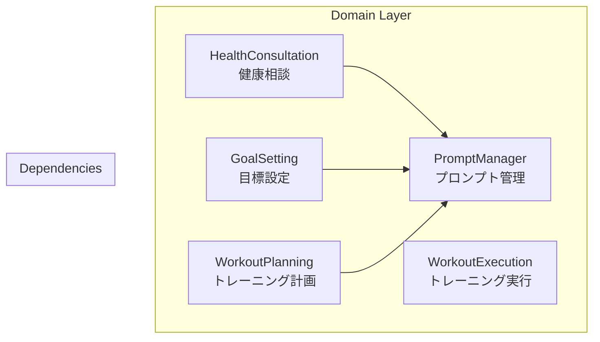
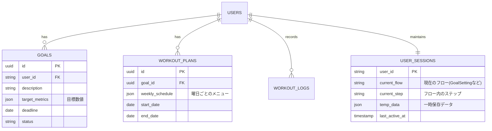
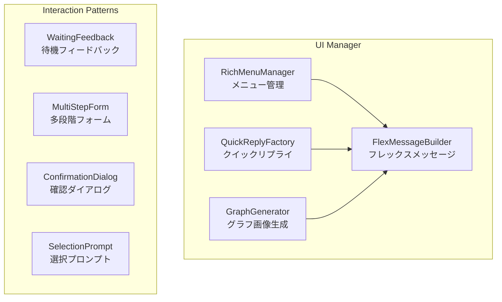
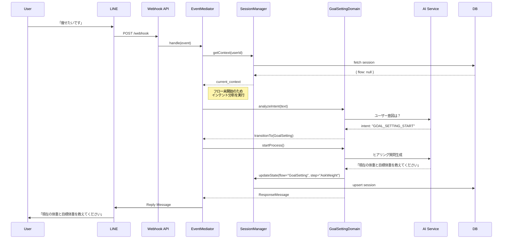

# ヘルスケアLINEシステム アーキテクチャ設計書

## 1. アーキテクチャ概要

本システムは、LINE Messaging APIを活用したAIフィットネストレーナーです。ユーザーとの自然言語対話を通じた目標設定、トレーニング計画の作成、進捗管理を実現するため、**ドメイン駆動設計 (DDD)** と **イベント駆動アーキテクチャ (EDA)** を採用しています。

### 1.1 設計思想 (Architectural Principles)

1.  **ドメイン中心 (Domain-Centric)**:
    *   技術的な関心事（LINE APIの仕様、DBの詳細）からビジネスロジック（目標設定ロジック、メニュー生成ロジック）を分離・保護します。
    *   4つの主要ドメイン（健康相談、目標設定、計画作成、実行記録）を明確に定義します。

2.  **イベント駆動 (Event-Driven)**:
    *   LINEの非同期かつステートレスな特性に合わせ、システム全体をイベント（メッセージ受信、ボタン押下、時間経過）への反応としてモデル化します。
    *   `EventMediator` パターンを用いて、イベントのルーティングと処理を疎結合に保ちます。

3.  **サーバーレス & ステートレス (Serverless & Stateless)**:
    *   Next.js App Router (API Routes) 上で動作し、リクエストごとに状態を復元・処理・保存して終了するステートレスな設計とします。
    *   永続化層には Supabase (PostgreSQL) を採用し、会話コンテキストやユーザー状態を管理します。

---

## 2. システム構成図

### 2.1 全体アーキテクチャ (C4 Level 2)



---

## 3. アプリケーション構造詳細

### 3.1 レイヤー構造

| レイヤー | 役割 | コンポーネント例 |
| :--- | :--- | :--- |
| **Interface** | 外部との入出力。HTTPリクエストの受付とレスポンス。 | `route.ts`, `WebhookValidator` |
| **Application** | アプリケーションの進行制御。イベントの調整、セッション管理。 | `EventMediator`, `SessionManager`, `ScenarioHandler` |
| **Domain** | 純粋なビジネスロジック。外部技術に依存しない。 | `Goal`, `WorkoutPlan`, `ConsultationService` |
| **Infrastructure** | 外部サービスやDBへの具体的なアクセス実装。 | `SupabaseRepository`, `OpenAIClient`, `LineMessagingClient` |

### 3.2 ドメイン層の詳細

各ドメインは独立したモジュールとして実装され、それぞれが専用の責務を持ちます。



1. **HealthConsultation (健康相談)**
   - 自由対話による健康相談の処理
   - 適切な健康アドバイスの生成
   - 相談履歴の管理

2. **GoalSetting (目標設定)**
   - 段階的な目標設定プロセスのガイド
   - 目標の検証と保存
   - 進捗トラッキングの初期化

3. **WorkoutPlanning (トレーニング計画)**
   - ユーザーの目標に基づくトレーニングメニュー作成
   - メニューのカスタマイズサポート
   - メニューのスケジューリング

4. **WorkoutExecution (トレーニング実行)**
   - 実行記録の管理
   - 達成度評価
   - フィードバックループの構築

### 3.3 主要コンポーネント

#### 1. Event Mediator (イベント調停者)
LINEからのWebhookイベントを受け取り、現在のユーザーセッション状態に基づいて適切なハンドラー（ドメインロジック）に振り分けます。
- **責務**: ルーティング、イベントログの記録、エラー時のフォールバック。

#### 2. Session Manager (セッション管理)
ユーザーの「文脈」を管理します。LINEはステートレスですが、ボットは「目標設定の途中」や「相談中」といった状態を持つ必要があります。
- **機能**:
    - `loadSession(userId)`: DBから最新の状態を取得。
    - `saveSession(userId, state)`: 状態の更新と永続化。
    - `clearSession(userId)`: フロー完了時の状態リセット。

#### 3. Domain Services (ドメインサービス)
各機能の中核となるロジックです。
- **HealthConsultation**: ユーザーの悩みを聞き、適切なアドバイスを生成。
- **GoalSetting**: SMARTの原則に基づき、ユーザーの曖昧な要望を具体的な目標データに変換。
- **WorkoutPlanning**: 目標と制約（場所、時間）から最適な週間メニューを生成。
- **WorkoutExecution**: 実施記録の保存と、計画に対する達成度の判定。

#### 4. AI Adapter & Prompt Manager
LLM (OpenAI) とのやり取りを抽象化します。
- **機能**:
    - テンプレートへのコンテキスト（ユーザー情報、過去ログ）注入。
    - Function Calling を用いた構造化データ（JSON）の抽出。
    - ストリーミング応答（必要に応じて）。

---

## 4. データモデル & 永続化

Supabase (PostgreSQL) を使用したリレーショナルデータモデルを採用します。

### 4.1 ER図概要



### 4.2 状態管理フロー
1.  **Fetch**: リクエスト受信時、`user_id` をキーに `USER_SESSIONS` と `USERS` を取得。
2.  **Process**: ビジネスロジックを実行。必要に応じて一時データ (`temp_data`) を更新。
3.  **Persist**: レスポンス返却直前に、変更されたセッション状態とビジネスデータ（Goalなど）をトランザクションで保存。

---

## 5. UI/UX & エラーハンドリング設計

### 5.1 LINE UI コンポーネント戦略
LINEの特性を活かしたリッチな表現と直感的な操作を提供するため、専用のUI管理コンポーネント群を定義します。



- **Flex Message Builder**: 複雑なレイアウト（トレーニングメニュー一覧、進捗グラフ風表示）を構築。
- **Quick Reply Factory**: ユーザーの入力負荷を下げるため、文脈に応じた選択肢（「はい」「いいえ」「完了」など）を動的に生成。
- **Rich Menu Manager**: ユーザーの状態（トレーニング中、設定中など）に応じてリッチメニューを動的に切り替え、コンテキストに合った操作を提供。

### 5.2 エラーハンドリングとリカバリー
ステートレスな環境でのエラーに対応するため、堅牢なリカバリーフローを構築します。

1.  **Global Error Handler**:
    - 予期せぬ例外をキャッチし、ユーザーには親しみやすい謝罪メッセージを送信。
    - 管理者にはSentry等でアラートを通知。
2.  **Graceful Degradation**:
    - OpenAI APIがダウンしている場合でも、基本的なメニュー操作や記録閲覧は可能にする（「AI機能は現在メンテナンス中ですが、記録は確認できます」）。
3.  **Context Recovery**:
    - セッションデータが破損している場合は、ユーザーに確認した上で「ホーム」状態にリセットする安全策を用意。

---

## 6. シーケンス設計

### 6.1 メッセージ受信〜応答フロー



---

## 7. ディレクトリ構造

`spec/01_system_design/directory_structure.md` に準拠しつつ、ドメイン駆動を意識した構成とします。

```
src/
├── app/api/line/webhook/   # エントリーポイント
├── domains/                # ドメイン層
│   ├── consultation/       # 相談ドメイン
│   ├── goal-setting/       # 目標設定ドメイン
│   ├── workout-planning/   # 計画作成ドメイン
│   └── shared/             # 共有ドメインモデル
├── application/            # アプリケーション層
│   ├── mediator/           # イベント調停
│   ├── session/            # セッション管理
│   └── usecases/           # アプリケーションユースケース
├── infrastructure/         # インフラ層
│   ├── line/               # LINE SDK wrapper
│   ├── openai/             # OpenAI SDK wrapper
│   └── supabase/           # DB Repository 実装
└── lib/                    # 汎用ユーティリティ
```

## 8. 今後の改善・拡張ロードマップ

1.  **パフォーマンス最適化**:
    - Vercel Edge Functions への移行によるコールドスタート対策。
    - 頻繁にアクセスするセッションデータの Redis (Upstash等) キャッシュ化。

2.  **LLM精度の向上**:
    - RAG (Retrieval-Augmented Generation) の導入による、専門知識（栄養学、運動生理学）に基づく回答の強化。
    - ユーザーごとの過去の会話ログを Vector Store に保存し、長期記憶を実現。

3.  **UX向上**:
    - LIFF (LINE Front-end Framework) の導入による、複雑な入力フォーム（カレンダー、数値入力）のユーザビリティ向上。
