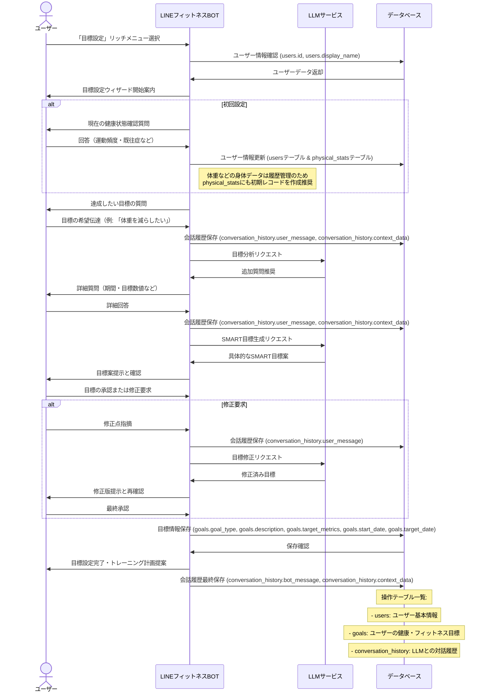
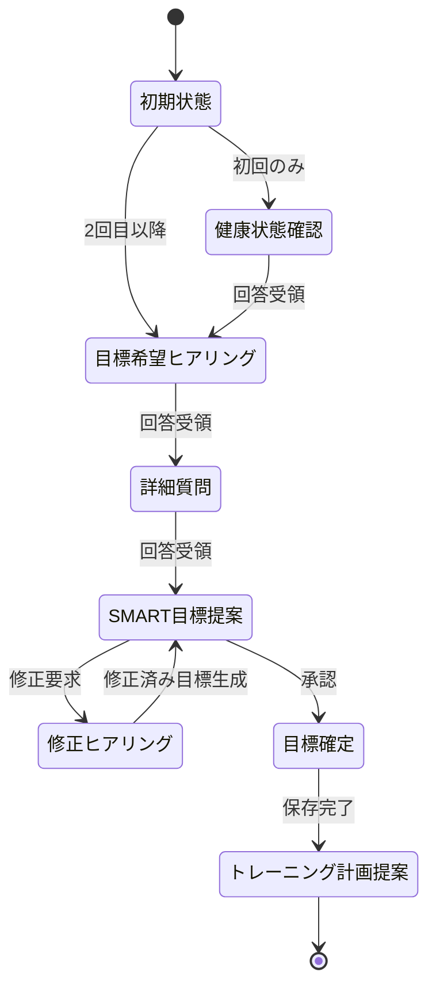

# 目標設定フロー

本ドキュメントでは、LINEフィットネスBOT における目標設定機能のユーザーフローと実装の詳細を定義します。

---

## 1. 機能概要
目標設定機能は、ユーザーの健康・フィットネス目標を LLM を活用した対話形式で設定し、SMART（Specific, Measurable, Achievable, Relevant, Time-bound）な形に変換します。

---

## 2. ユーザーフロー図



---

## 3. 状態遷移図



---

## 4. 実装詳細

### 4.1 目標タイプ分類
| コード | 分類 | 例 |
| --- | --- | --- |
| weight_loss | 減量 | 体重減少、体脂肪率減少 |
| muscle_gain | 筋肉増強 | 筋肉量増加、筋力向上 |
| endurance | 持久力向上 | 走行距離/時間向上 |
| flexibility | 柔軟性向上 | 柔軟性数値向上 |
| health_recovery | 健康回復 | 特定症状の改善 |
| habit_formation | 習慣形成 | 運動習慣の定着 |

### 4.2 メッセージテンプレート

#### 開始メッセージ
```
フィットネス目標を一緒に設定しましょう！
具体的で達成可能な目標を立てることが成功への第一歩です。
まずはどのような目標をお持ちですか？
（例: 体重を減らしたい、筋肉をつけたい、マラソン完走など）
```

#### 詳細質問（体重減少例）
```
体重減少が目標なのですね。
より具体的な計画を立てるために、以下の情報を教えていただけますか？

1. 現在の体重は？（kg）
2. 目標体重は？（kg）
3. どのくらいの期間で達成したいですか？（〇ヶ月）
4. 週に何回くらい運動できそうですか？
```

#### SMART目標提案
```
あなたの情報を基に、以下の目標はいかがでしょうか？

【目標】
3ヶ月で体重を60kgから55kgに減らす（-5kg）

【スケジュール】
- 1ヶ月目: -2kg（58kg）
- 2ヶ月目: -1.5kg（56.5kg）
- 3ヶ月目: -1.5kg（55kg）

【アプローチ】
- 週3回、30分の有酸素運動
- 週2回の筋力トレーニング
- 1日の摂取カロリー約1,800kcalを目安に

この目標でよろしいですか？
```

### 4.3 LLMプロンプト例

#### 目標分析プロンプト
```
あなたはフィットネス専門トレーナーです。ユーザーが示した目標「{{user_goal}}」を分析し、SMART（Specific, Measurable, Achievable, Relevant, Time-bound）な目標に変換するための追加情報を収集するための質問を3つ考えてください。ユーザープロフィール:
- 性別: {{gender}}
- 年齢: {{age}}
- 身長: {{height}}cm
- 体重: {{weight}}kg
- 運動頻度: {{exercise_frequency}}
```

#### SMART目標生成プロンプト
```
ユーザーの情報と希望を基に、フィットネス目標をSMART形式で具体化してください。
- 目標タイプ: {{goal_type}}
- ユーザー情報: {{user_profile}}
- 希望: {{user_wish}}
- 期間: {{timeframe}}
- 制約条件: {{constraints}}

以下の形式で回答してください：
1. 具体的な数値目標
2. 月単位の小目標
3. 週間トレーニング計画の概要
4. 食事に関する一般的アドバイス
```

### 4.4 主要データモデル

#### 4.4.1 目標の基本構造
 - 詳細は data-model.md 参照

```typescript
interface Goal {
  id: string;
  user_id: string;
  goal_type: GoalType; // 'weight_loss' | 'muscle_gain' | 'endurance' | ...
  description: string;
  motivation?: string; // ユーザーの目標達成動機
  target_metrics: {
    start_value: number;
    target_value: number;
    unit: string;
  };
  start_date: Date;
  target_date: Date;
  progress_percentage: number; // 0-100%
  status: 'active' | 'achieved' | 'abandoned';
  created_at: Date;
  updated_at: Date;
}
```

### 4.5 テーブル別 DB 操作一覧（クロス表）

凡例: C = Create (INSERT) | R = Read (SELECT) | U = Update (UPDATE) | D = Delete (DELETE)

イベントは時系列順。ループする操作は「※繰返」と表記。

##### 1. users テーブル

| いつ発生するか | 操作 | 主な列 / 補足 |
|--------------|-----|-------------|
| ウィザード開始 | R | id, age, height_cm, initial_weight_kg, ... — プロフィール取得 |
| 初回プロフィール入力 | U | 欠損していた age, height_cm, initial_weight_kg を更新 |
| 既存目標の再設定判定 | R | id, preferences などを読み、前回目標を持つか確認 |

##### 2. goals テーブル

| いつ発生するか | 操作 | 主な列 / 補足 |
|--------------|-----|-------------|
| 目標確定（BEGIN...COMMIT 内） | C | id(ULID), user_id, goal_type, description, target_metrics, start_date, target_date など |
| 目標再設定チェック | R | user_id, status — 最新のアクティブ目標を取得 |
| 進捗更新バッチ（別機能） | U | progress_percentage／status を更新 |

##### 3. conversation_history テーブル

| いつ発生するか | 操作 | 主な列 / 補足 |
|--------------|-----|-------------|
| 各 Q&A 後 ※繰返 | C | id(ULID), user_id, message_type='user'/'bot', payload, created_at |
| SMART 草案生成直後 | C | message_type='draft' |
| ユーザーが承認 | U | status='confirmed' |
| 目標確定トランザクション | C | message_type='system', payload='goal_committed' |
| ロールバック発生時 | – | トランザクション全体を ROLLBACK—直前の 2 INSERT が取消 |

---

## 5. バリデーション & 制約

- 目標減量速度: 健康的な減量は週0.5-1kgまで、それ以上は警告
- 目標期間: 最短2週間～最長1年の範囲内
- 体重増加目標: 健康的な筋肉増加は月1-2kgまで
- 不健康な目標の拒否: 危険な減量目標などは設定不可・代替提案

---

## 6. 関連ドキュメント
- データモデル: [`database_design.md`](../02_data_model/database_design.md)

---

> **更新履歴**
> - 2024-04-11: 初版作成 