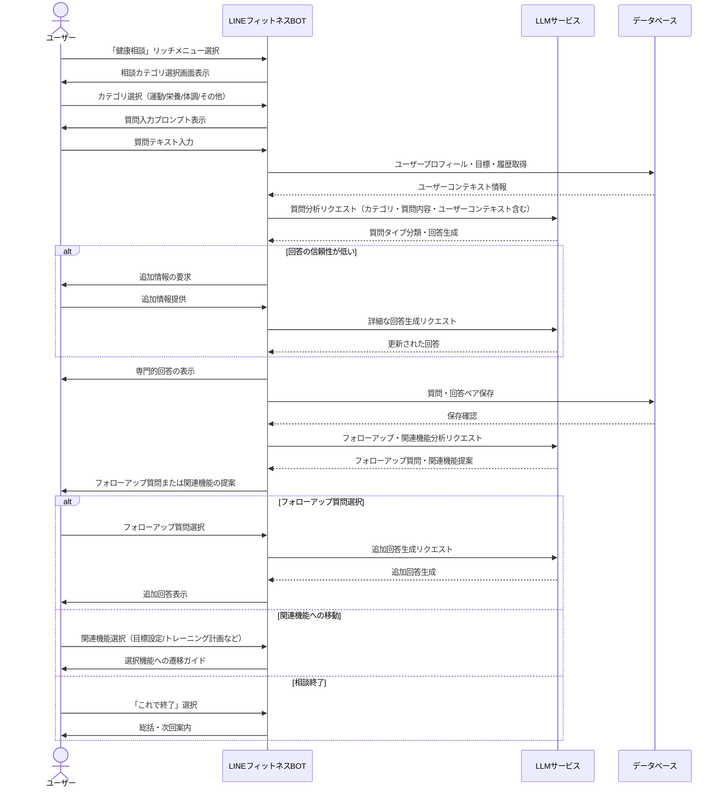
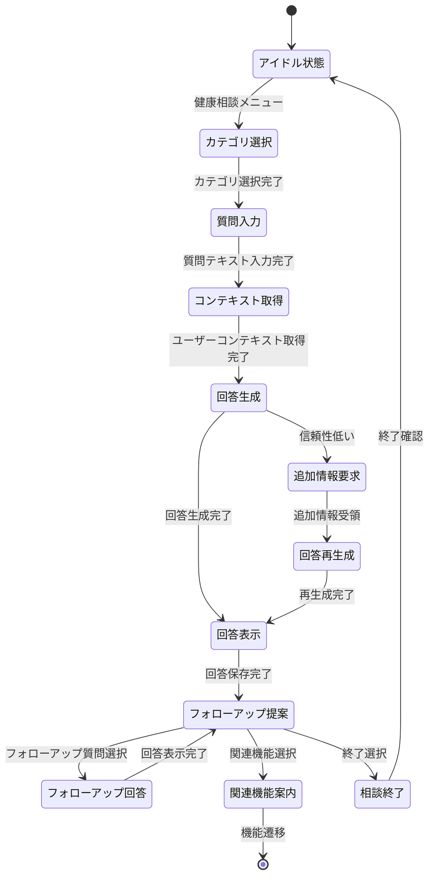

# 健康相談フロー

本ドキュメントでは、LINEフィットネスBOT における健康相談機能のユーザーフローと実装の詳細を定義します。

---

## 1. 機能概要
健康相談機能は、ユーザーの健康・フィットネスに関する質問に対して、LLMを活用した専門的なアドバイスを提供するものです。トレーニング方法、栄養、体調管理、モチベーション維持などの幅広いカテゴリの相談に対応し、科学的根拠に基づいた回答と、ユーザーの目標達成をサポートする関連機能への案内を提供します。

---

## 2. ユーザーフロー図



---

## 3. 状態遷移図



---

## 4. 実装詳細

### 4.1 相談カテゴリ分類
| コード | 分類 | 説明 | 質問例 |
| --- | --- | --- | --- |
| training | トレーニング相談 | 運動方法・効果・プランに関する質問 | 「腹筋を効率的に鍛える方法は？」 |
| nutrition | 栄養・食事相談 | 食事・栄養摂取に関する質問 | 「筋トレ後に何を食べるべき？」 |
| health | 体調・体の悩み | 体調不良・痛み・症状に関する質問 | 「運動後の筋肉痛を早く治すには？」 |
| motivation | モチベーション | 継続のコツ・心理面の質問 | 「トレーニングを続けるコツは？」 |
| equipment | 器具・環境 | トレーニング器具・環境に関する質問 | 「自宅でできる効果的な器具は？」 |
| general | 一般・その他 | 上記に分類されない質問 | 「フィットネスの最新トレンドは？」 |

### 4.2 メッセージテンプレート

#### カテゴリ選択画面
```
健康相談メニューです。
どのようなご質問ですか？カテゴリを選択してください：

1. トレーニング方法・効果
2. 栄養・食事アドバイス
3. 体調・体の悩み
4. モチベーション維持
5. トレーニング器具・環境
6. その他の質問
```

#### 質問入力プロンプト
```
【トレーニング方法・効果】についてのご質問ですね。
具体的にお聞きになりたいことを、自由に入力してください。

例：「大胸筋を効率的に鍛えるトレーニングは？」
  「30分の有酸素運動で消費できるカロリーは？」
```

#### 回答表示例
```
Q: 筋トレと有酸素運動はどちらを先にやるべきですか？

A: 目標によって異なりますが、一般的には以下が推奨されます：

1. 筋力増強が目標の場合：
   → 筋トレを先に行い、エネルギーが充実した状態で高強度トレーニングに集中

2. 脂肪燃焼・減量が目標の場合：
   → どちらを先にしても効果に大きな差はありませんが、有酸素運動後の筋トレは高強度の維持が難しくなることがあります

3. 実践的アドバイス：
   - 両方とも高強度で行いたい場合は別々の日に分ける
   - 同日に行う場合は、より重視する方を先に実施する

あなたの目標は体重減少なので、いずれの順序でも効果的ですが、疲労しにくい筋トレから始めるのがおすすめです。

他に気になることはありますか？
```

#### フォローアップ・関連機能提案
```
以下についても確認しますか？

1. 筋トレと有酸素運動の理想的な組み合わせ頻度は？
2. 目的別おすすめの有酸素運動メニューを見る
3. あなたの目標に合わせたトレーニング計画を作成する
4. この相談は終了する
```

### 4.3 LLMプロンプト例

#### 質問回答生成プロンプト
```
あなたは健康・フィットネスの専門家です。以下の質問に対して、科学的根拠に基づいた正確で役立つ回答を提供してください。

【ユーザー情報】
- 性別: {{gender}}
- 年齢: {{age}}
- 目標: {{goal}}
- トレーニング歴: {{training_experience}}
- 健康状態: {{health_condition}}

【質問カテゴリ】
{{category}}

【質問内容】
{{question}}

【関連コンテキスト（過去の質問・トレーニング記録）】
{{relevant_context}}

以下のガイドラインに従って回答してください：
1. 300字以内でコンパクトに回答する
2. 科学的根拠に基づく情報を提供する
3. ユーザーの目標と状況に合わせてパーソナライズする
4. 専門用語は避けるか説明を加える
5. 具体的で実行可能なアドバイスを含める
6. 医学的診断や治療に該当する内容は避け、適切な場合は医療専門家への相談を推奨する

回答では「私の意見では」「私は思います」などの表現は避け、客観的な情報を提供してください。
```

#### フォローアップ・関連機能生成プロンプト
```
以下の質問と回答に基づいて、適切なフォローアップ質問と関連機能への誘導を提案してください。

【質問】
{{question}}

【回答】
{{answer}}

【ユーザー目標】
{{goal}}

【BOT機能リスト】
- 目標設定: 健康・フィットネス目標の設定と管理
- トレーニング計画: 目標に基づいたトレーニングプラン作成
- 記録・進捗: トレーニング実績や身体指標の記録と可視化
- 今日のタスク: 当日のトレーニングスケジュール表示

以下を提供してください：
1. 関連する2-3個のフォローアップ質問
2. ユーザーの質問と目標に最も関連するBOT機能1-2個の提案と理由
```

### 4.4 データモデル

```typescript
interface Consultation {
  id: string;
  user_id: string;
  category: string; // 'training', 'nutrition', 'health', etc.
  question: string;
  answer: string;
  followup_questions?: string[];
  related_features?: string[];
  prompt_context?: {
    user_profile: object;
    goal_context: object;
    training_history: object;
  };
  created_at: Date;
}

interface SafetyFilter {
  category: string;
  keywords: string[];
  replacement_response: string;
  report_level: 'log' | 'notify' | 'block';
}
```

### 4.5 知識ベース・安全対策

#### 禁止カテゴリー
以下のカテゴリの質問には回答しない、または一般的な健康アドバイスへのリダイレクトを行います：
- 医学的診断・治療アドバイス
- 疾病・怪我の具体的な治療法
- 薬物・サプリメントの具体的な用量アドバイス
- 極端な食事制限や危険なトレーニング法
- 専門家の判断が必要な健康リスク評価

#### 専門家リファラル
以下の場合は、専門家への相談を促すメッセージを表示します：
- 継続的な痛みや不調に関する質問
- 特定の疾患に関連する運動相談
- 薬剤との相互作用に関する質問
- 妊娠中・授乳中の特殊なケース
- 18歳未満の成長期トレーニング

#### 知識ソース
LLMの基本知識に加え、以下の情報ソースを優先的に参照します：
- アメリカスポーツ医学会(ACSM)ガイドライン
- 日本体力医学会、日本栄養士会の推奨事項
- エビデンスベースの学術研究・メタアナリシス
- 一般的に認められたトレーニング原則

---

## 5. フロー間連携

### 5.1 他機能への遷移パターン
| 質問カテゴリ | 誘導先機能 | 遷移条件 |
| --- | --- | --- |
| トレーニング法 | トレーニング計画 | 具体的なプラン希望時 |
| 目標達成法 | 目標設定 | 明確な目標がない場合 |
| 進捗確認 | 記録・進捗 | 記録データに基づく分析希望時 |
| 当日実施内容 | 今日のタスク | 具体的な行動指針希望時 |

### 5.2 コンテクスト連携
質問・回答履歴は保存され、以下の場面で活用されます：
- 関連質問の回答精度向上
- 目標設定時の参考情報
- トレーニング計画作成時の制約条件
- 進捗分析時の背景情報

---

## 6. 拡張機能（将来）

- **音声質問**: 音声入力での質問対応
- **画像認識**: フォーム確認のための画像分析
- **ビデオ回答**: 動作解説動画の自動生成・推奨
- **専門家連携**: 高度な質問の人間専門家への転送
- **コミュニティQ&A**: 類似ユーザー間での質問・回答共有
- **チャット履歴検索**: 過去の質問・回答の検索機能

---

> **更新履歴**
> - 2024-04-11: 初版作成