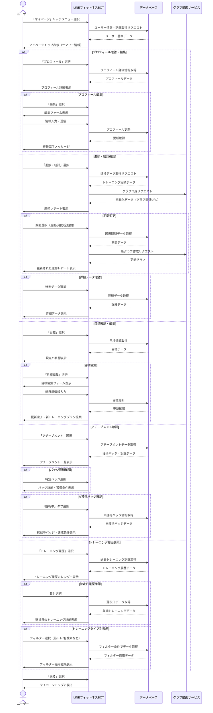
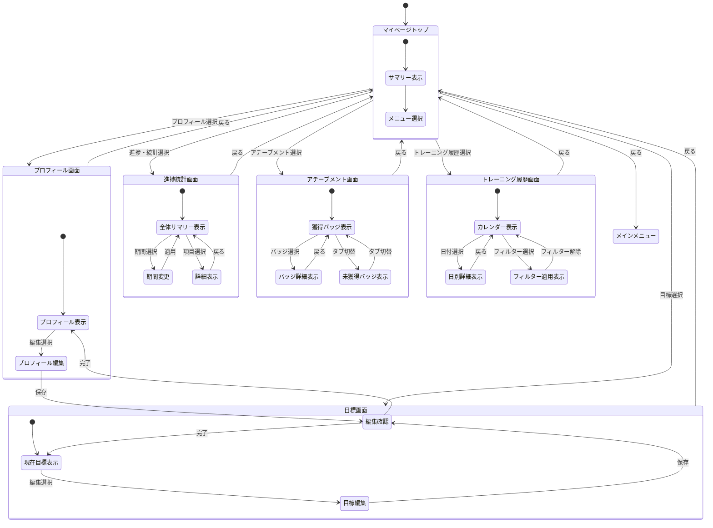

# マイページフロー

本ドキュメントでは、LINEフィットネスBOT におけるマイページ機能のユーザーフローと実装の詳細を定義します。

---

## 1. 機能概要
マイページ機能は、ユーザーの健康状態・トレーニングの記録・進捗・実績などの情報を一元的に表示し、自身の状況を把握したり、過去の記録を振り返ったりするための機能です。ユーザーのモチベーション維持やトレーニング計画の見直しに役立ちます。

---

## 2. ユーザーフロー図



---

## 3. 状態遷移図



---

## 4. 画面構成とデータ表示

### 4.1 マイページトップ（サマリー）

サマリー情報には、ユーザーの現在の状況を一目で把握できる情報を表示します。

```
【マイページ】

■ 基本情報
名前: 田中太郎
目標: 体重5kg減量（2024年6月まで）
現在の達成度: 40%（2kg減量達成）

■ 最近の活動サマリー
今週のアクティビティ: 3/5日 完了
連続記録: 5日間継続中 🔥
消費カロリー（今週）: 約2,200kcal

■ 次回予定
明日: 下半身トレーニング（45分）

メニュー：
【プロフィール】【進捗・統計】【目標】
【アチーブメント】【トレーニング履歴】
```

### 4.2 プロフィール画面

```
【プロフィール】

■ 基本情報
名前: 田中太郎
年齢: 35歳
性別: 男性
身長: 175cm
体重: 73kg（開始時: 75kg）
BMI: 23.8（標準）

■ 健康情報
血圧: 120/80（最終測定: 2024/3/28）
安静時心拍数: 68（最終測定: 2024/4/5）
体脂肪率: 22%（最終測定: 2024/4/1）

■ トレーニング設定
トレーニング頻度: 週4回
主な運動場所: 自宅、ジム
利用可能器具: ダンベル、ヨガマット

【編集する】【マイページに戻る】
```

### 4.3 進捗・統計画面

```
【進捗・統計】

■ 表示期間: 先月 | 今月 | 全期間

■ 体重推移
[ここに体重グラフ画像]
開始: 75kg → 現在: 73kg（-2kg, -2.7%）

■ 運動実績
- トレーニング日数: 15/30日（50%）
- 合計時間: 450分（7.5時間）
- 消費カロリー: 約3,500kcal

■ トレーニングバランス
[ここに円グラフ画像]
- 筋力トレーニング: 45%
- 有酸素運動: 35%
- ストレッチ/柔軟性: 20%

■ 成長指標（先月比）
- 腕立て伏せ最大回数: +3回
- 5kmランニングタイム: -2分10秒
- 体脂肪率: -0.8%

【詳細データを見る】【期間を変更】【マイページに戻る】
```

### 4.4 目標画面

```
【目標設定】

■ 現在の目標
主目標: 体重5kg減量（2024年6月まで）
進捗率: 40%（2kg減量達成）
残り期間: 2ヶ月

■ サブ目標
1. 週4回以上のトレーニング実施
   進捗率: 75%（平均3回/週達成中）
2. 腕立て伏せ30回連続達成
   進捗率: 66%（現在20回）
3. 5kmを30分以内で走る
   進捗率: 80%（現在32分10秒）

■ 目標達成予測
現在のペースでは: 2024年7月頃に達成見込み
推奨アクション:
- 週に1回の有酸素運動を追加
- 食事管理の強化

【目標を編集する】【マイページに戻る】
```

### 4.5 アチーブメント画面

```
【アチーブメント】

■ 獲得バッジ【獲得済み】【挑戦中】

▼ 獲得済みバッジ（8/30）
🏆 ファーストステップ（初回トレーニング完了）
🔥 ストリーク3日達成（連続3日間トレーニング）
🔥 ストリーク7日達成（連続7日間トレーニング）
💪 筋トレビギナー（筋トレ累計10回達成）
🏃 ランナービギナー（ランニング累計5回達成）
📊 記録マスター（10日連続記録達成）
⚖️ 減量スタート（体重1kg減少達成）
🥗 健康食習慣（食事記録7日間連続）

▼ 近日中に獲得可能
💪 筋トレチャレンジャー（あと2回で達成）
🔥 ストリーク14日達成（あと9日で達成）
⚖️ 順調減量（あと0.5kgで達成）

【詳細を見る】【マイページに戻る】
```

### 4.6 トレーニング履歴画面

```
【トレーニング履歴】

■ 2024年4月
[ここにカレンダー表示 - トレーニング実施日にはマーク]

■ フィルタ：【全て】【筋トレ】【有酸素】【ストレッチ】

▼ 2024年4月8日（月）
・上半身筋力トレーニング（40分）
  詳細: ベンチプレス 3x10, ショルダープレス 3x12, ...
  メモ: 「肩の調子が良くなってきた。重量を少し増やせそう」

・リカバリーストレッチ（15分）

▼ 2024年4月6日（土）
・5kmランニング（32分10秒）
  詳細: ペース 6分25秒/km, 最大心拍数 156
  メモ: 「前回より30秒タイム短縮！」

・下半身筋力トレーニング（45分）

【日付を選択】【マイページに戻る】
```

---

## 5. データモデル (ViewModel)

※ 以下のモデルは、マイページ表示用にバックエンドで集計・整形された ViewModel です。DB上は `users`, `goals`, `physical_stats`, `workout_records` などのテーブルに分散して保存されています。

### 5.1 ユーザープロフィール (ViewModel)

```typescript
interface UserProfileViewModel {
  id: string;
  line_user_id: string;
  name: string;
  age?: number;
  gender?: string;
  height_cm?: number;
  weight_kg?: {
    current: number;
    initial: number;
    // physical_stats から履歴を取得・整形
    history: {
      date: string;
      value: number;
    }[];
  };
  body_metrics?: {
    body_fat_percentage?: number;
    resting_heart_rate?: number;
    blood_pressure?: {
      systolic: number;
      diastolic: number;
    };
    last_updated: Date;
  };
  // preferences カラム (JSONB) の内容
  training_preferences?: {
    frequency: string; 
    preferred_locations: string[];
    available_equipment: string[];
    preferred_time: string; 
  };
  health_conditions?: string[];
  created_at: Date;
  updated_at: Date;
}
```

### 5.2 目標データ (ViewModel)

```typescript
interface UserGoalViewModel {
  id: string;
  user_id: string;
  // goals.target_metrics (JSONB) をパースして展開
  primary_goal: {
    type: string; 
    target_value: number;
    current_value: number;
    initial_value: number;
    unit: string;
    target_date: Date;
  };
  // goals.target_metrics.sub_goals から展開
  sub_goals: {
    id: string;
    type: string;
    description: string;
    target_value: number;
    current_value: number;
    unit: string;
    status: string; 
  }[];
  history: {
    date: Date;
    primary_goal_value: number;
    notes?: string;
  }[];
  created_at: Date;
  updated_at: Date;
}
```

### 5.3 アチーブメントデータ

```typescript
interface Achievement {
  id: string;
  name: string;
  description: string;
  icon: string;
  category: string; // "streak", "strength", "cardio", "nutrition", etc.
  requirements: {
    metric: string;
    operator: string; // ">=", "=", etc.
    value: number;
    duration?: string; // "single", "consecutive_days", etc.
  };
  difficulty: string; // "beginner", "intermediate", "advanced"
  xp_reward?: number;
}

interface UserAchievement {
  id: string;
  user_id: string;
  achievement_id: string;
  earned_date: Date;
  progress: number; // 0-100% for in-progress achievements
  created_at: Date;
  updated_at: Date;
}
```

### 5.4 トレーニング履歴

```typescript
interface WorkoutSession {
  id: string;
  user_id: string;
  date: Date;
  workout_type: string[];
  duration_minutes: number;
  calories_burned?: number;
  exercises: {
    exercise_id: string;
    name: string;
    sets?: number;
    reps?: number;
    weight?: number;
    duration_minutes?: number;
    distance?: number;
    notes?: string;
  }[];
  user_feedback?: {
    perceived_effort: number; // 1-10
    mood: string;
    notes: string;
  };
  created_at: Date;
  updated_at: Date;
}
```

---

## 6. 視覚化とグラフ表現

### 6.1 グラフ種類と用途

| グラフ種類 | 用途 | 実装方法 |
| --- | --- | --- |
| 折れ線グラフ | 体重・パフォーマンス指標の推移 | Canvas API/Chart.js |
| 棒グラフ | 週間/月間トレーニング頻度比較 | Canvas API/Chart.js |
| 円グラフ | トレーニングタイプ分布 | Canvas API/Chart.js |
| カレンダーヒートマップ | トレーニング実施日の視覚化 | カスタムビジュアル |
| レーダーチャート | 総合的なフィットネスバランス | Canvas API/Chart.js |

### 6.2 モチベーション向上要素

| 機能 | 説明 |
| --- | --- |
| 進捗バー | 目標達成度を視覚的に表示（40%など） |
| 成長指標 | 過去の自分と比較して向上した指標を強調表示 |
| 予測ライン | 現在のペースでの目標達成予測を表示 |
| ストリークカウンター | 連続記録日数を目立つように表示 |
| バッジサムネイル | 獲得バッジのサムネイルをトップに表示 |

---

## 7. セキュリティ考慮事項

### 7.1 プライバシー設定
- ユーザーはプロフィールの公開/非公開を設定可能
- 特に健康データに関しては、表示/非表示の詳細設定が可能
- データの共有範囲をユーザーが制御可能（個人用/コーチのみ/友人も含む）

### 7.2 データアクセス
- 認証されたLINEユーザーIDとの厳格な紐付け
- センシティブ情報表示時の追加認証オプション
- 非アクティブ期間が長い場合のセッション再確認

### 7.3 データバックアップ・エクスポート
- ユーザーデータの定期バックアップ
- CSVやJSONへのデータエクスポート機能
- プラットフォーム間でのデータポータビリティ

---

## 8. 将来拡張予定機能

- **目標達成予測モデル**: 機械学習を活用したより正確な目標達成予測
- **ソーシャル機能拡張**: 友人との進捗共有やチャレンジ機能
- **プラットフォーム連携**: Apple Health, Google Fitなどとの連携
- **詳細な身体測定記録**: 部位別の寸法変化追跡
- **AI分析レポート**: トレーニングパターンを分析したパーソナルレポート

---

> **更新履歴**
> - 2024-04-11: 初版作成 