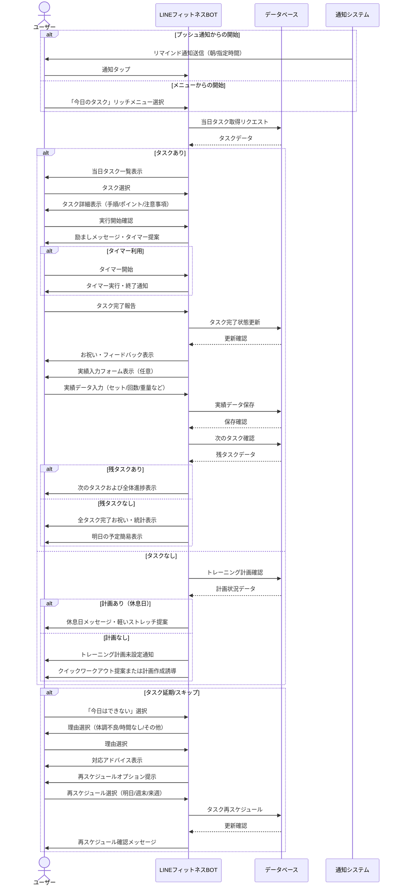
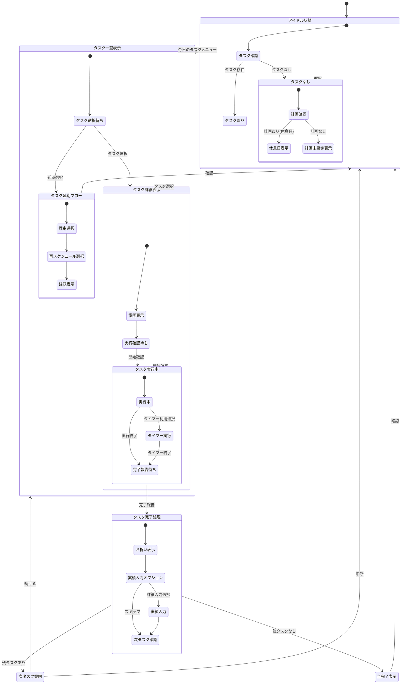

# 今日のタスクフロー

本ドキュメントでは、LINEフィットネスBOT における今日のタスク機能のユーザーフローと実装の詳細を定義します。

---

## 1. 機能概要
今日のタスク機能は、ユーザーが設定したトレーニング計画に基づき、当日実行すべきトレーニングメニューを表示し、実行・記録の流れをシームレスに提供する機能です。リマインド通知と連携し、日々のトレーニング習慣の定着とモチベーション維持を支援します。

---

## 2. ユーザーフロー図



---

## 3. 状態遷移図



---

## 4. 実装詳細

### 4.1 タスクステータス定義
| ステータス | 説明 |
| --- | --- |
| scheduled | 予定通り未実行 |
| in_progress | 実行中 |
| completed | 完了済み |
| skipped | スキップ（再スケジュールなし） |
| rescheduled | 延期（再スケジュール済み） |
| cancelled | キャンセル |

### 4.2 メッセージテンプレート

#### 当日タスク一覧表示
```
本日（4月11日）のトレーニングタスクです：

1. [未完了] 朝のストレッチ (10分)
2. [完了済] 筋力トレーニング：上半身 (40分)
3. [未完了] 有酸素運動：ウォーキング (30分)

タスクを選択して詳細を表示するか、「今日はできない」を選択してください。

本日の進捗: 33% (1/3 完了)
```

#### タスク詳細表示（例：筋力トレーニング）
```
【上半身筋力トレーニング - 40分】

内容:
- ベンチプレス: 3セット×10回 (50kg)
- ダンベルショルダープレス: 3セット×12回 (10kg)
- ラットプルダウン: 3セット×10回 (40kg)
- 腕立て伏せ: 3セット×15回

実施のポイント:
- セット間の休息は60-90秒
- フォームを重視し、反動を使わない
- 息を止めずに呼吸を意識する

準備物：ジムでの実施を想定

このトレーニングを開始しますか？
【開始する】【今日はできない】
```

#### タスク完了フィードバック
```
素晴らしい！上半身トレーニングを完了しました 🎉

今日のトレーニングの詳細を記録しますか？
【詳細を記録する】【スキップ】

次のタスク：有酸素運動（ウォーキング 30分）
全体進捗: 67% (2/3 完了)
```

#### 全タスク完了表示
```
おめでとうございます！🏆
本日のトレーニングタスクをすべて完了しました！

本日の成果:
- 総トレーニング時間: 80分
- 消費カロリー(推定): 約420kcal
- 週間目標進捗: 57% (4/7 日)

明日のタスク:
- 下半身筋力トレーニング (45分)
- リカバリーストレッチ (15分)

継続は力なり！引き続き頑張りましょう！
```

#### タスク延期・再スケジュール
```
今日はトレーニングができない理由を教えてください：
【体調がすぐれない】【時間がない】【モチベーション低下】【その他】

選択: 時間がない

理解しました。お忙しい日もありますね。
このタスクをいつに再スケジュールしますか？
【明日に追加】【週末に追加】【来週の同じ曜日】【キャンセル】
```

### 4.3 通知テンプレート

#### 朝のリマインダー
```
おはようございます！
本日のトレーニングメニューが3件あります。
タップして確認しましょう。
```

#### タスク直前リマインダー
```
【トレーニングリマインド】
30分後に「上半身筋力トレーニング」の予定があります。
準備はOKですか？
```

#### タスク未完了リマインダー
```
まだ完了していないタスクがあります：
・有酸素運動：ウォーキング (30分)

今日中に実施しますか？
```

### 4.4 データモデル (ViewModel)

※ ここで定義する `Task` はアプリケーション層で扱う ViewModel であり、データベース上の実体は `workout_sessions` テーブルです。

```typescript
// ViewModel: DBの workout_sessions をラップして表示用に整形したもの
interface TaskViewModel {
  id: string; // workout_sessions.id
  user_id: string;
  session_id: string; // workout_sessions.id
  title: string; // workout_sessions.name
  description: string;
  scheduled_date: Date;
  scheduled_time?: string;
  duration_minutes: number;
  task_type: string; // workout_sessions.session_type
  status: TaskStatus; // workout_sessions.status
  completion_date?: Date; // workout_records から取得
  performance_data?: { // workout_records から取得
    sets?: number;
    reps?: number;
    weight?: number;
    distance?: number;
    calories?: number;
    notes?: string;
  };
  user_feedback?: string;
  // 再スケジュール追跡用（DB設計書: workout_sessions.rescheduled_from に対応）
  rescheduled_from?: string; 
  created_at: Date;
  updated_at: Date;
}

interface TaskReminder {
  id: string;
  task_id: string; // workout_sessions.id
  user_id: string;
  reminder_type: string; 
  scheduled_time: Date;
  status: string;
  created_at: Date;
}

interface DailyProgressViewModel {
  date: string;
  user_id: string;
  total_tasks: number;
  completed_tasks: number;
  skipped_tasks: number;
  total_duration_minutes: number;
  streak_days: number;
  created_at: Date;
}
```

### 4.5 タイマー機能

タスク実行中のサポートとして、以下のタイマー機能を提供します：

- **カウントダウンタイマー**: セット間の休息時間計測（通常60-90秒）
- **インターバルタイマー**: HIIT等のインターバル運動の時間管理
- **エクササイズタイマー**: 全体の運動時間の計測（30分など）

タイマーは以下の方法で実装します：
1. LINEの標準機能を利用（簡易的なカウント通知）
2. Web版タイマーへのリンク提供（高機能版）

---

## 5. リマインド戦略

### 5.1 通知タイミング
| タイミング | 目的 | 内容 |
| --- | --- | --- |
| 朝（8:00頃） | 1日の計画確認 | 当日タスク概要と予定時間 |
| タスク30分前 | 準備促進 | 個別タスク内容と準備物 |
| 夕方（未完了時） | 完了促進 | 未完了タスク一覧 |
| 就寝前（21:00頃） | 振り返り促進 | 達成状況と翌日の予告 |

### 5.2 パーソナライズ設定
ユーザーは以下の通知設定をカスタマイズ可能：
- 通知ON/OFF
- 通知時間帯
- 通知頻度（すべて/重要のみ）
- 休日設定（休日は通知しない等）

### 5.3 適応型リマインド
以下の要素に基づいて通知をパーソナライズします：
- 過去の完了パターン（よく完了する時間帯を学習）
- 未完了タスクの傾向（スキップしやすいタスクタイプを把握）
- ユーザーの反応（通知への反応率）

---

## 6. ガミフィケーション要素

### 6.1 継続モチベーション機能
| 機能 | 説明 | 実装方法 |
| --- | --- | --- |
| ストリーク | 連続達成日数の表示 | カレンダー表示と数値カウント |
| アチーブメント | 特定条件達成時のバッジ | 「7日連続達成」「筋トレマスター」等 |
| 週間サマリー | 週の終わりの総括レポート | グラフ・統計情報の視覚化 |
| レベルアップ | 継続によるレベル上昇 | レベル・経験値システム |

### 6.2 競争・協力要素（将来拡張）
- ランキングシステム（同年代・同目標ユーザー間）
- グループチャレンジ（友人との共同目標）
- コミュニティ達成（全ユーザーでの大目標）

---

> **更新履歴**
> - 2024-04-11: 初版作成 