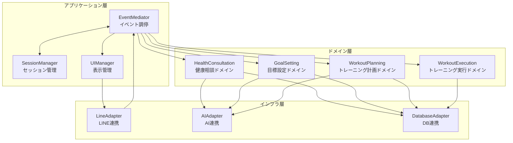
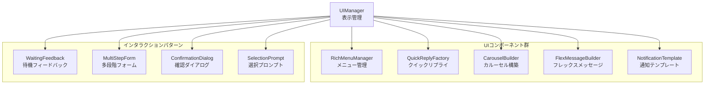
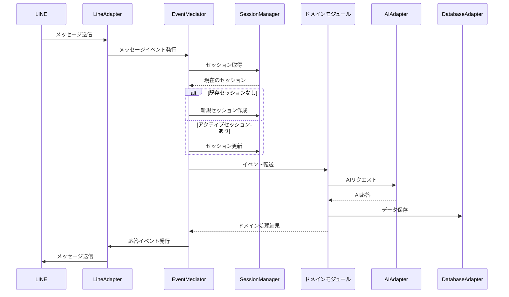

# LINEフィットネスBOTアーキテクチャ再設計案

LINEのUI特性から逆算した最適アーキテクチャを検討します。

## 1. ドメイン中心設計

### 核となる設計思想
LINEは会話型UIであり、状態遷移が非同期的に発生するため、**イベント駆動型**かつ**ドメイン中心**の設計が適切です。



## 2. イベント駆動型アーキテクチャ

LINEの非同期的な会話フローに対応するため、イベント駆動型アーキテクチャを採用します。

### 主要コンポーネント

1. **EventMediator（イベント調停者）**
   - すべてのイベントのルーティングを担当
   - ドメイン間の連携を疎結合に保つ
   - 複雑なイベントフローのオーケストレーション

2. **SessionManager（セッション管理）**
   - ユーザーごとの会話コンテキスト管理
   - 会話の文脈維持と適切な状態遷移
   - タイムアウト処理と状態復元

3. **UIManager（表示管理）**
   - LINEの豊富なメッセージタイプを抽象化
   - 状態に応じた適切なUIコンポーネント選択
   - インタラクションパターンのテンプレート化

## 3. ドメインごとの責務分離

各ドメインは独立したモジュールとして実装し、それぞれが専用の責務を持ちます。

1. **HealthConsultation（健康相談）**
   - 自由対話による健康相談の処理
   - 適切な健康アドバイスの生成
   - 相談履歴の管理

2. **GoalSetting（目標設定）**
   - 段階的な目標設定プロセスのガイド
   - 目標の検証と保存
   - 進捗トラッキングの初期化

3. **WorkoutPlanning（トレーニング計画）**
   - ユーザーの目標に基づくトレーニングメニュー作成
   - メニューのカスタマイズサポート
   - メニューのスケジューリング

4. **WorkoutExecution（トレーニング実行）**
   - 実行記録の管理
   - 達成度評価
   - フィードバックループの構築

## 4. LINE特化型UIコンポーネント

LINEの特性を最大限に活かすUI設計を行います。



## 5. 適応型状態管理

会話の文脈と状態を柔軟に管理するシステムを構築します。



## 6. データフローの最適化

LINEとAI、データベース間のデータフローを最適化します。

1. **冗長通信の削減**
   - 必要な場合のみAI呼び出し
   - セッションキャッシュの活用
   - バッチ処理によるDB更新

2. **応答速度の向上**
   - タイピングインジケーターの積極活用
   - 段階的応答（クイック応答→詳細応答）
   - バックグラウンド処理とUI更新の分離

3. **オフライン対応**
   - 一時的なネットワーク切断への対応
   - 再接続時の状態復元
   - フォールバックメカニズム

## 7. 推奨実装アプローチ

```
/
├── src/
│   ├── domains/                # ドメインロジック
│   │   ├── healthConsultation/ # 健康相談ドメイン
│   │   ├── goalSetting/        # 目標設定ドメイン
│   │   ├── workoutPlanning/    # トレーニング計画ドメイン
│   │   └── workoutExecution/   # トレーニング実行ドメイン
│   │
│   ├── application/            # アプリケーション層
│   │   ├── eventMediator.ts    # イベント調停
│   │   ├── sessionManager.ts   # セッション管理
│   │   └── uiManager.ts        # UI管理
│   │
│   ├── infrastructure/         # インフラ層
│   │   ├── lineAdapter.ts      # LINE連携
│   │   ├── aiAdapter.ts        # AI連携
│   │   └── databaseAdapter.ts  # DB連携
│   │
│   ├── ui/                     # UI管理
│   │   ├── components/         # UIコンポーネント
│   │   │   ├── richMenu.ts
│   │   │   ├── quickReply.ts
│   │   │   └── carousel.ts
│   │   │
│   │   └── patterns/           # インタラクションパターン
│   │       ├── waitingFeedback.ts
│   │       ├── multiStepForm.ts
│   │       └── selectionPrompt.ts
│   │
│   ├── events/                 # イベント定義
│   │   ├── messageEvents.ts
│   │   ├── sessionEvents.ts
│   │   └── domainEvents.ts
│   │
│   └── utils/                  # ユーティリティ
│
├── config/                     # 設定ファイル
│   ├── prompts/                # AIプロンプト
│   │   ├── healthConsultation.yaml
│   │   ├── goalSetting.yaml
│   │   └── workoutPlanning.yaml
│   │
│   └── ui/                     # UI設定
│       ├── richMenus.yaml
│       └── messageTemplates.yaml
│
└── tests/                      # テスト
```

この設計アプローチにより、LINE UIの特性を最大限に活かしながら、拡張性と保守性の高いシステムを構築できます。ドメイン駆動設計とイベント駆動アーキテクチャの組み合わせは、LINEのような会話型インターフェースに特に適しており、将来的な機能追加にも柔軟に対応できます。 