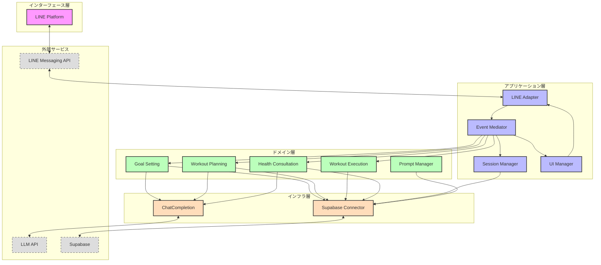
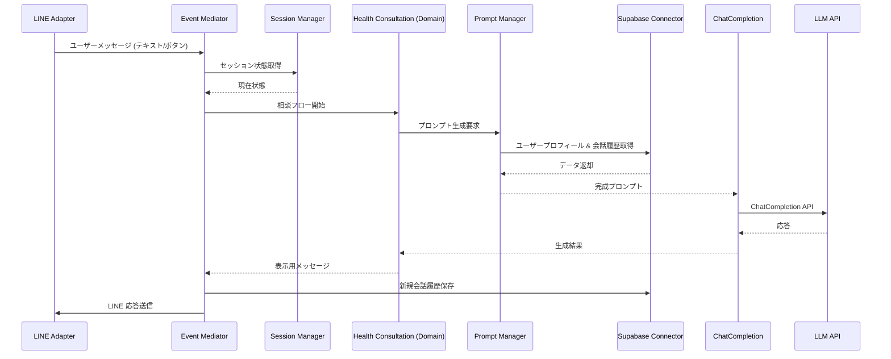
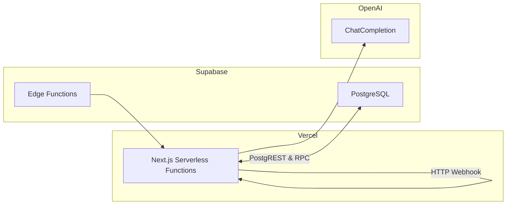

# システム構成・アーキテクチャ

本ドキュメントでは LINEフィットネスBOT のシステム構成、主要コンポーネントの責務、ならびにデータ／イベントフローを示します。

---

## 1. 俯瞰図（レイヤ構造）
以下はインターフェース層・アプリケーション層・ドメイン層・インフラ層に分割したレイヤ構造です。

---

## 2. コンポーネント責務
| レイヤ | コンポーネント | 主な責務 |
| --- | --- | --- |
| インターフェース | LINE Adapter | LINE Messaging API と Webhook イベントの変換／送受信 |
| アプリケーション | Event Mediator | 全イベント（メッセージ・ボタン・タイマー）のルーティング、オーケストレーション |
|  | Session Manager | ユーザーごとの現在ステート管理、タイムアウト処理、状態復元 |
|  | UI Manager | LINE メッセージ・リッチメニューなど UI コンポーネントの生成 |
| ドメイン | Goal Setting / Workout Planning / Workout Execution / Health Consultation | 各ドメインロジック実装（目標設定、プラン生成・進捗管理、相談回答など） |
|  | Prompt Manager | プロンプトテンプレート管理、会話履歴取得、LLM API 呼び出し前の整形 |
| インフラ | ChatCompletion | OpenAI 等 LLM API のラッパー、リトライ・レート制御 |
|  | Supabase Connector | DB アクセス、RLS 準拠、Edge Functions 呼び出し |

---

## 3. 会話処理シーケンス
LLM を伴う代表的なシーケンス（相談フロー）を示します。

---

## 4. データフロー
1. **読み取り系**: Session Manager / Domain が Supabase からプロフィール・履歴をフェッチ
2. **書き込み系**: 会話履歴・トレーニング実績・身体指標を Supabase に保存
3. **LLM 呼び出し**: Prompt Manager が ChatCompletion 経由で外部 LLM API を呼び出し
4. **通知系**: Edge Functions が定期バッチをトリガーし LINE Push API 経由でリマインド送信

---

## 5. デプロイ構成（例）

※ 実際のインフラは Vercel/Cloudflare Workers/自社クラウド などに置き換え可。

---

## 6. 技術スタック
- **言語**: TypeScript (Node.js 18+)
- **フレームワーク**: Next.js / Fastify など（要件に応じて選択）
- **インフラ**: Supabase (DB・Edge Functions・Auth)、Vercel (Serverless)、OpenAI API
- **CI/CD**: GitHub Actions (テスト → Lint → デプロイ)

---

## 7. 可観測性 & セキュリティ
| 項目 | 方針 |
| --- | --- |
| ロギング | OpenTelemetry + Supabase Edge Functions Logs |
| トレーシング | X-Ray / Grafana Tempo など選択肢 |
| アラート | GitHub Actions, Slack 通知 |
| 認証 | LINE OAuth + Supabase Auth, RLS で Row Level Security |
| シークレット管理 | Vercel / GitHub Actions Secrets |

---

## 8. 拡張ポイント
- 他サービス連携（Apple HealthKit / Google Fit）
- AI モデル多様化（栄養推奨モデル、画像解析モデル）
- マルチプラットフォーム展開（WhatsApp, Telegram 等）

---

> **更新履歴**
> - 2024-04-11: 初版作成 