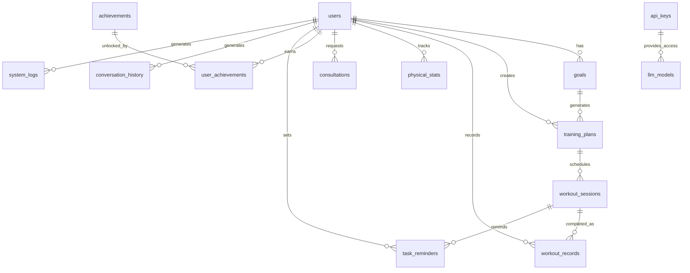

# LINEフィットネスBOT - データベース要件定義書

## 1. 概要

このドキュメントは、LLMを活用したLINEフィットネスBOTシステムのデータベース要件を定義するものです。データベーススキーマの一元管理を目的とし、各テーブル定義、リレーション、インデックス、およびアクセス制御を包括的に記述します。本システムはユーザーの健康・フィットネス目標設定、トレーニング計画管理、進捗記録、健康相談などの機能をサポートします。

## 2. データベース基本情報

| 項目 | 内容 |
|------|------|
| データベース名 | line_fitness_bot_db |
| RDBMS | PostgreSQL 14+ |
| 文字セット | UTF-8 |
| 照合順序 | ja_JP.utf8 |
| タイムゾーン | Asia/Tokyo |
| 接続方式 | Supabase / pgBouncer |
| バックアップ頻度 | 日次（フル）、時間単位（増分） |
| スキーマ名 | public |

## 3. テーブル一覧

| テーブル論理名 | テーブル物理名 | 概要 | 想定レコード数 |
|--------------|--------------|------|----------------|
| ユーザー | users | ユーザー基本情報 | 〜100万 |
| 目標 | goals | ユーザーの健康・フィットネス目標 | 〜300万 |
| トレーニング計画 | training_plans | 目標達成のためのトレーニングプラン | 〜300万 |
| トレーニングセッション | workout_sessions | 計画された個別セッション | 〜1000万 |
| トレーニング記録 | workout_records | 実施されたトレーニングの記録 | 〜1000万 |
| 身体指標 | physical_stats | 体重・体脂肪率などの身体測定値 | 〜3000万 |
| 健康相談 | consultations | 健康・フィットネスに関する質問と回答 | 〜500万 |
| アチーブメント | achievements | 達成可能な称号・バッジの定義 | 〜100 |
| ユーザーアチーブメント | user_achievements | ユーザーが獲得した称号・バッジ | 〜1000万 |
| タスクリマインダー | task_reminders | トレーニングリマインド設定 | 〜1000万 |
| 会話履歴 | conversation_history | LLMとの対話履歴保存 | 〜5000万 |
| APIキー | api_keys | 外部API連携用のキー情報 | 〜10 |
| LLMモデル | llm_models | 利用可能なLLMモデル情報 | 〜10 |
| システム設定 | settings | システム設定情報 | 〜100 |
| システムログ | system_logs | システムログ情報 | 〜1億 |

## 4. 詳細テーブル定義

### 4.1 ユーザーテーブル (users)

ユーザーの基本情報を管理するテーブル

| カラム論理名 | カラム物理名 | データ型 | NULL | 初期値 | 制約 | 説明 |
|------------|------------|---------|------|-------|------|------|
| ユーザーID | id | UUID | NO | gen_random_uuid() | PK | 内部ユーザー識別子（主キー） |
| LINEユーザーID | external_line_user_id | VARCHAR(64) | NO | | UK | LINE Platform提供のユーザーID |
| 表示名 | display_name | VARCHAR(255) | NO | | | LINEの表示名 |
| 年齢 | age | INTEGER | YES | NULL | | ユーザーの年齢 |
| 性別 | gender | VARCHAR(16) | YES | NULL | | 性別（male/female/other） |
| 身長(cm) | height_cm | NUMERIC(5,2) | YES | NULL | | ユーザーの身長 |s
| 初期体重(kg) | initial_weight_kg | NUMERIC(5,2) | YES | NULL | | 登録時の体重 |
| メールアドレス | email | VARCHAR(255) | YES | NULL | | 連絡先メールアドレス（通知用・オプション） |
| 通知有効フラグ | notifications_enabled | BOOLEAN | NO | TRUE | | 通知の有効/無効 |
| ユーザー設定 | preferences | JSONB | YES | NULL | | ユーザー設定情報（通知時間帯、UI設定など） |
| 作成日時 | created_at | TIMESTAMP WITH TIME ZONE | NO | CURRENT_TIMESTAMP | | レコード作成日時 |
| 最終アクティブ日時 | last_active | TIMESTAMP WITH TIME ZONE | YES | NULL | | 最後にアクティブだった日時 |

**インデックス**:
- PRIMARY KEY (id)
- UNIQUE INDEX idx_users_external_line_user_id (external_line_user_id)
- INDEX idx_users_last_active (last_active)
- INDEX idx_users_email (email) WHERE email IS NOT NULL

### 4.2 目標テーブル (goals)

ユーザーの健康・フィットネス目標を管理するテーブル

| カラム論理名 | カラム物理名 | データ型 | NULL | 初期値 | 制約 | 説明 |
|------------|------------|---------|------|-------|------|------|
| 目標ID | id | UUID | NO | gen_random_uuid() | PK | 目標一意識別子 |
| ユーザーID | user_id | UUID | NO | | FK | users(id) を参照 |
| 目標タイプ | goal_type | VARCHAR(32) | NO | | | 目標タイプ（weight_loss/muscle_gain/endurance等） |
| 詳細説明 | description | TEXT | NO | | | 目標の詳細説明 |
| 動機 | motivation | TEXT | YES | NULL | | ユーザーの目標達成動機 |
| 目標指標 | target_metrics | JSONB | NO | | | 目標の測定指標（JSONフォーマット） |
| 開始日 | start_date | DATE | NO | | | 目標開始日 |
| 目標日 | target_date | DATE | NO | | | 目標達成予定日 |
| 進捗率 | progress_percentage | NUMERIC(5,2) | NO | 0 | | 進捗率（0-100%） |
| 状態 | status | VARCHAR(16) | NO | 'active' | | 状態（active/achieved/abandoned） |
| 作成日時 | created_at | TIMESTAMP WITH TIME ZONE | NO | CURRENT_TIMESTAMP | | レコード作成日時 |
| 更新日時 | updated_at | TIMESTAMP WITH TIME ZONE | NO | CURRENT_TIMESTAMP | | レコード更新日時 |

**インデックス**:
- PRIMARY KEY (id)
- INDEX idx_goals_user_id (user_id)
- INDEX idx_goals_status (status)
- INDEX idx_goals_target_date (target_date)

**外部キー制約**:
- FOREIGN KEY (user_id) REFERENCES users(id) ON DELETE CASCADE

### 4.3 トレーニング計画テーブル (training_plans)

目標達成のためのトレーニングプランを管理するテーブル

| カラム論理名 | カラム物理名 | データ型 | NULL | 初期値 | 制約 | 説明 |
|------------|------------|---------|------|-------|------|------|
| 計画ID | id | UUID | NO | gen_random_uuid() | PK | 計画一意識別子 |
| ユーザーID | user_id | UUID | NO | | FK | users(id) を参照 |
| 目標ID | goal_id | UUID | YES | NULL | FK | 関連目標ID |
| 計画名 | name | VARCHAR(255) | NO | | | 計画の名称 |
| 詳細説明 | description | TEXT | YES | NULL | | 計画の詳細説明 |
| 計画タイプ | plan_type | VARCHAR(32) | NO | | | 計画タイプ（strength/weight_loss/endurance等） |
| 開始日 | start_date | DATE | NO | | | 計画開始日 |
| 終了予定日 | end_date | DATE | NO | | | 計画終了予定日 |
| 状態 | status | VARCHAR(16) | NO | 'active' | | 状態（active/completed/abandoned） |
| スケジュール設定 | schedule_settings | JSONB | NO | | | スケジュール設定（JSONフォーマット） |
| 作成日時 | created_at | TIMESTAMP WITH TIME ZONE | NO | CURRENT_TIMESTAMP | | レコード作成日時 |
| 更新日時 | updated_at | TIMESTAMP WITH TIME ZONE | NO | CURRENT_TIMESTAMP | | レコード更新日時 |

**インデックス**:
- PRIMARY KEY (id)
- INDEX idx_training_plans_user_id (user_id)
- INDEX idx_training_plans_goal_id (goal_id)
- INDEX idx_training_plans_status (status)
- INDEX idx_training_plans_date_range (start_date, end_date)

**外部キー制約**:
- FOREIGN KEY (user_id) REFERENCES users(id) ON DELETE CASCADE
- FOREIGN KEY (goal_id) REFERENCES goals(id) ON DELETE SET NULL

### 4.4 トレーニングセッションテーブル (workout_sessions)

計画された個別トレーニングセッションを管理するテーブル

| カラム論理名 | カラム物理名 | データ型 | NULL | 初期値 | 制約 | 説明 |
|------------|------------|---------|------|-------|------|------|
| セッションID | id | UUID | NO | gen_random_uuid() | PK | セッション一意識別子 |
| 計画ID | plan_id | UUID | NO | | FK | 関連計画ID |
| セッション名 | name | VARCHAR(255) | NO | | | セッション名称 |
| 詳細説明 | description | TEXT | YES | NULL | | セッションの詳細説明 |
| 予定日 | scheduled_date | DATE | NO | | | 予定日 |
| 予定時間帯 | scheduled_time | VARCHAR(16) | YES | NULL | | 予定時間帯（morning/afternoon/evening等） |
| 予定所要時間（分） | duration_minutes | INTEGER | NO | | | 予定所要時間 |
| セッションタイプ | session_type | VARCHAR(32) | NO | | | セッションタイプ（strength/cardio/flexibility等） |
| エクササイズ内容 | exercises | JSONB | NO | | | エクササイズ詳細（JSONフォーマット） |
| 状態 | status | VARCHAR(16) | NO | 'scheduled' | | 状態（scheduled/completed/skipped/cancelled） |
| 作成日時 | created_at | TIMESTAMP WITH TIME ZONE | NO | CURRENT_TIMESTAMP | | レコード作成日時 |
| 更新日時 | updated_at | TIMESTAMP WITH TIME ZONE | NO | CURRENT_TIMESTAMP | | レコード更新日時 |

**インデックス**:
- PRIMARY KEY (id)
- INDEX idx_workout_sessions_plan_id (plan_id)
- INDEX idx_workout_sessions_date (scheduled_date)
- INDEX idx_workout_sessions_status (status)

**外部キー制約**:
- FOREIGN KEY (plan_id) REFERENCES training_plans(id) ON DELETE CASCADE

### 4.5 トレーニング記録テーブル (workout_records)

実施されたトレーニングの記録を管理するテーブル

| カラム論理名 | カラム物理名 | データ型 | NULL | 初期値 | 制約 | 説明 |
|------------|------------|---------|------|-------|------|------|
| 記録ID | id | UUID | NO | gen_random_uuid() | PK | 記録一意識別子 |
| ユーザーID | user_id | UUID | NO | | FK | users(id) を参照 |
| セッションID | session_id | UUID | YES | NULL | FK | 関連セッションID（予定に基づく場合） |
| 実施日 | record_date | DATE | NO | | | 実施日 |
| 実施時刻 | record_time | TIME | YES | NULL | | 実施時刻 |
| トレーニングタイプ | workout_type | VARCHAR(32) | NO | | | トレーニングタイプ |
| 実施時間（分） | duration_minutes | INTEGER | NO | | | 実施時間 |
| 実施内容 | exercises_completed | JSONB | NO | | | 完了したエクササイズ詳細（JSONフォーマット） |
| 強度レベル | intensity_level | INTEGER | YES | NULL | | 主観的強度レベル（1-10） |
| フィードバック | feedback | TEXT | YES | NULL | | フィードバック・感想 |
| 作成日時 | created_at | TIMESTAMP WITH TIME ZONE | NO | CURRENT_TIMESTAMP | | レコード作成日時 |

**インデックス**:
- PRIMARY KEY (id)
- INDEX idx_workout_records_user_id (user_id)
- INDEX idx_workout_records_session_id (session_id)
- INDEX idx_workout_records_date (record_date)
- INDEX idx_workout_records_type (workout_type)

**外部キー制約**:
- FOREIGN KEY (user_id) REFERENCES users(id) ON DELETE CASCADE
- FOREIGN KEY (session_id) REFERENCES workout_sessions(id) ON DELETE SET NULL

### 4.6 身体指標テーブル (physical_stats)

体重・体脂肪率などの身体測定値を管理するテーブル

| カラム論理名 | カラム物理名 | データ型 | NULL | 初期値 | 制約 | 説明 |
|------------|------------|---------|------|-------|------|------|
| 記録ID | id | UUID | NO | gen_random_uuid() | PK | 記録一意識別子 |
| ユーザーID | user_id | UUID | NO | | FK | users(id) を参照 |
| 測定日 | record_date | DATE | NO | | | 測定日 |
| 体重(kg) | weight_kg | NUMERIC(5,2) | YES | NULL | | 体重 |
| 体脂肪率(%) | body_fat_percentage | NUMERIC(4,2) | YES | NULL | | 体脂肪率 |
| 筋肉量(kg) | muscle_mass_kg | NUMERIC(5,2) | YES | NULL | | 筋肉量 |
| その他測定値 | other_metrics | JSONB | YES | NULL | | その他の測定値（JSONフォーマット） |
| 作成日時 | created_at | TIMESTAMP WITH TIME ZONE | NO | CURRENT_TIMESTAMP | | レコード作成日時 |

**インデックス**:
- PRIMARY KEY (id)
- INDEX idx_physical_stats_user_id (user_id)
- INDEX idx_physical_stats_date (record_date)
- UNIQUE INDEX idx_physical_stats_user_date (user_id, record_date)

**外部キー制約**:
- FOREIGN KEY (user_id) REFERENCES users(id) ON DELETE CASCADE

### 4.7 健康相談テーブル (consultations)

健康・フィットネスに関する質問と回答を管理するテーブル

| カラム論理名 | カラム物理名 | データ型 | NULL | 初期値 | 制約 | 説明 |
|------------|------------|---------|------|-------|------|------|
| 相談ID | id | UUID | NO | gen_random_uuid() | PK | 相談一意識別子 |
| ユーザーID | user_id | UUID | NO | | FK | users(id) を参照 |
| カテゴリ | category | VARCHAR(32) | NO | | | 相談カテゴリ（training/nutrition/health等） |
| 質問内容 | question | TEXT | NO | | | 質問内容 |
| 回答内容 | answer | TEXT | NO | | | 回答内容 |
| コンテキストデータ | context_data | JSONB | YES | NULL | | コンテキストデータ（JSONフォーマット） |
| 作成日時 | created_at | TIMESTAMP WITH TIME ZONE | NO | CURRENT_TIMESTAMP | | レコード作成日時 |

**インデックス**:
- PRIMARY KEY (id)
- INDEX idx_consultations_user_id (user_id)
- INDEX idx_consultations_category (category)
- INDEX idx_consultations_created_at (created_at)

**外部キー制約**:
- FOREIGN KEY (user_id) REFERENCES users(id) ON DELETE CASCADE

### 4.8 アチーブメントテーブル (achievements)

達成可能な称号・バッジの定義を管理するテーブル

| カラム論理名 | カラム物理名 | データ型 | NULL | 初期値 | 制約 | 説明 |
|------------|------------|---------|------|-------|------|------|
| アチーブメントID | id | UUID | NO | gen_random_uuid() | PK | アチーブメント一意識別子 |
| コード | code | VARCHAR(50) | NO | | UK | アチーブメント識別コード |
| 名称 | name | VARCHAR(100) | NO | | | アチーブメント名称 |
| 説明 | description | TEXT | NO | | | アチーブメントの説明 |
| カテゴリ | category | VARCHAR(32) | NO | | | カテゴリ（streak/strength/cardio/nutrition等） |
| アイコンURL | icon_url | VARCHAR(255) | YES | NULL | | アイコン画像のURL |
| 獲得条件 | requirements | JSONB | NO | | | 獲得条件（JSONフォーマット） |
| 獲得XP | xp_reward | INTEGER | NO | 0 | | 獲得時の経験値ポイント |
| 作成日時 | created_at | TIMESTAMP WITH TIME ZONE | NO | CURRENT_TIMESTAMP | | レコード作成日時 |

**インデックス**:
- PRIMARY KEY (id)
- UNIQUE INDEX idx_achievements_code (code)
- INDEX idx_achievements_category (category)

### 4.9 ユーザーアチーブメントテーブル (user_achievements)

ユーザーが獲得した称号・バッジを管理するテーブル

| カラム論理名 | カラム物理名 | データ型 | NULL | 初期値 | 制約 | 説明 |
|------------|------------|---------|------|-------|------|------|
| 記録ID | id | UUID | NO | gen_random_uuid() | PK | 記録一意識別子 |
| ユーザーID | user_id | UUID | NO | | FK | users(id) を参照 |
| アチーブメントID | achievement_id | UUID | NO | | FK | アチーブメントID |
| 獲得日時 | earned_at | TIMESTAMP WITH TIME ZONE | NO | CURRENT_TIMESTAMP | | 獲得日時 |
| 進捗率 | progress_percentage | INTEGER | YES | NULL | | 獲得前の進捗率（0-100%） |
| 作成日時 | created_at | TIMESTAMP WITH TIME ZONE | NO | CURRENT_TIMESTAMP | | レコード作成日時 |
| 更新日時 | updated_at | TIMESTAMP WITH TIME ZONE | NO | CURRENT_TIMESTAMP | | レコード更新日時 |

**インデックス**:
- PRIMARY KEY (id)
- INDEX idx_user_achievements_user_id (user_id)
- INDEX idx_user_achievements_achievement_id (achievement_id)
- UNIQUE INDEX idx_user_achievements_user_achievement (user_id, achievement_id)

**外部キー制約**:
- FOREIGN KEY (user_id) REFERENCES users(id) ON DELETE CASCADE
- FOREIGN KEY (achievement_id) REFERENCES achievements(id) ON DELETE CASCADE

### 4.10 タスクリマインダーテーブル (task_reminders)

トレーニングリマインド設定を管理するテーブル

| カラム論理名 | カラム物理名 | データ型 | NULL | 初期値 | 制約 | 説明 |
|------------|------------|---------|------|-------|------|------|
| リマインダーID | id | UUID | NO | gen_random_uuid() | PK | リマインダー一意識別子 |
| ユーザーID | user_id | UUID | NO | | FK | users(id) を参照 |
| セッションID | session_id | UUID | NO | | FK | 関連セッションID |
| リマインド日時 | reminder_time | TIMESTAMP WITH TIME ZONE | NO | | | リマインド予定日時 |
| リマインド種別 | reminder_type | VARCHAR(32) | NO | | | 種別（before_session/missed_session等） |
| 送信済みフラグ | is_sent | BOOLEAN | NO | FALSE | | 送信済みかどうか |
| 作成日時 | created_at | TIMESTAMP WITH TIME ZONE | NO | CURRENT_TIMESTAMP | | レコード作成日時 |

**インデックス**:
- PRIMARY KEY (id)
- INDEX idx_task_reminders_user_id (user_id)
- INDEX idx_task_reminders_session_id (session_id)
- INDEX idx_task_reminders_time (reminder_time)
- INDEX idx_task_reminders_sent (is_sent)

**外部キー制約**:
- FOREIGN KEY (user_id) REFERENCES users(id) ON DELETE CASCADE
- FOREIGN KEY (session_id) REFERENCES workout_sessions(id) ON DELETE CASCADE

### 4.11 会話履歴テーブル (conversation_history)

LLMとの対話履歴を保存するテーブル

| カラム論理名 | カラム物理名 | データ型 | NULL | 初期値 | 制約 | 説明 |
|------------|------------|---------|------|-------|------|------|
| 会話ID | id | UUID | NO | gen_random_uuid() | PK | 会話一意識別子 |
| ユーザーID | user_id | UUID | NO | | FK | users(id) を参照 |
| メッセージ種別 | message_type | VARCHAR(20) | NO | | | メッセージ種別（user/bot/system） |
| ユーザーメッセージ | user_message | TEXT | YES | NULL | | ユーザーからのメッセージ内容 |
| ボットメッセージ | bot_message | TEXT | YES | NULL | | ボットからのメッセージ内容 |
| コンテキストデータ | context_data | JSONB | YES | NULL | | コンテキストデータ（JSONフォーマット） |
| 作成日時 | created_at | TIMESTAMP WITH TIME ZONE | NO | CURRENT_TIMESTAMP | | レコード作成日時 |

**インデックス**:
- PRIMARY KEY (id)
- INDEX idx_conversation_history_user_id (user_id)
- INDEX idx_conversation_history_created_at (created_at)
- INDEX idx_conversation_history_message_type (message_type)

**外部キー制約**:
- FOREIGN KEY (user_id) REFERENCES users(id) ON DELETE CASCADE

### 4.12 APIキーテーブル (api_keys)

外部API連携用のキー情報を管理するテーブル

| カラム論理名 | カラム物理名 | データ型 | NULL | 初期値 | 制約 | 説明 |
|------------|------------|---------|------|-------|------|------|
| APIキーID | id | UUID | NO | gen_random_uuid() | PK | APIキー一意識別子 |
| サービス名 | service | VARCHAR(50) | NO | | | サービス名（LINE/OpenAI/Azure等） |
| キー名 | key_name | VARCHAR(100) | NO | | | APIキーの名称 |
| キー値 | key_value | VARCHAR(255) | NO | | | 暗号化されたAPIキー値 |
| 説明 | description | TEXT | YES | NULL | | APIキーの説明 |
| 状態 | status | VARCHAR(20) | NO | 'active' | | 状態（active/inactive/revoked） |
| 作成日時 | created_at | TIMESTAMP WITH TIME ZONE | NO | CURRENT_TIMESTAMP | | レコード作成日時 |
| 更新日時 | updated_at | TIMESTAMP WITH TIME ZONE | NO | CURRENT_TIMESTAMP | | レコード更新日時 |
| 有効期限 | expires_at | TIMESTAMP WITH TIME ZONE | YES | NULL | | キーの有効期限 |

**インデックス**:
- PRIMARY KEY (id)
- UNIQUE INDEX idx_api_keys_service_name (service, key_name)
- INDEX idx_api_keys_status (status)
- INDEX idx_api_keys_expires_at (expires_at)

### 4.13 LLMモデルテーブル (llm_models)

利用可能なLLMモデル情報を管理するテーブル

| カラム論理名 | カラム物理名 | データ型 | NULL | 初期値 | 制約 | 説明 |
|------------|------------|---------|------|-------|------|------|
| モデルID | id | UUID | NO | gen_random_uuid() | PK | モデル一意識別子 |
| モデル名 | model_name | VARCHAR(100) | NO | | UK | モデルの名称 |
| プロバイダー | provider | VARCHAR(50) | NO | | | モデルプロバイダー（OpenAI/Azure/Anthropic等） |
| APIキーID | api_key_id | UUID | YES | NULL | FK | api_keysテーブルの外部キー |
| 最大トークン | max_tokens | INTEGER | NO | 4096 | | 最大トークン数 |
| コンテキスト長 | context_window | INTEGER | NO | 8000 | | モデルのコンテキストウィンドウサイズ |
| 設定パラメータ | parameters | JSONB | YES | NULL | | モデル設定パラメータ（JSONフォーマット） |
| 状態 | status | VARCHAR(20) | NO | 'active' | | モデルの状態（active/inactive/deprecated） |
| 作成日時 | created_at | TIMESTAMP WITH TIME ZONE | NO | CURRENT_TIMESTAMP | | レコード作成日時 |
| 更新日時 | updated_at | TIMESTAMP WITH TIME ZONE | NO | CURRENT_TIMESTAMP | | レコード更新日時 |

**インデックス**:
- PRIMARY KEY (id)
- UNIQUE INDEX idx_llm_models_name (model_name)
- INDEX idx_llm_models_provider (provider)
- INDEX idx_llm_models_status (status)

**外部キー制約**:
- FOREIGN KEY (api_key_id) REFERENCES api_keys(id) ON DELETE SET NULL

### 4.14 システム設定テーブル (settings)

システム設定情報を管理するテーブル

| カラム論理名 | カラム物理名 | データ型 | NULL | 初期値 | 制約 | 説明 |
|------------|------------|---------|------|-------|------|------|
| 設定ID | id | UUID | NO | gen_random_uuid() | PK | 設定一意識別子 |
| 設定キー | setting_key | VARCHAR(100) | NO | | UK | 設定項目のキー |
| 設定値 | setting_value | TEXT | YES | NULL | | 設定値 |
| データ型 | data_type | VARCHAR(20) | NO | 'string' | | 設定値のデータ型（string/integer/boolean/json） |
| 説明 | description | TEXT | YES | NULL | | 設定項目の説明 |
| グループ | group_name | VARCHAR(50) | NO | 'general' | | 設定グループ名 |
| 作成日時 | created_at | TIMESTAMP WITH TIME ZONE | NO | CURRENT_TIMESTAMP | | レコード作成日時 |
| 更新日時 | updated_at | TIMESTAMP WITH TIME ZONE | NO | CURRENT_TIMESTAMP | | レコード更新日時 |

**インデックス**:
- PRIMARY KEY (id)
- UNIQUE INDEX idx_settings_key (setting_key)
- INDEX idx_settings_group (group_name)

### 4.15 システムログテーブル (system_logs)

システムログ情報を管理するテーブル

| カラム論理名 | カラム物理名 | データ型 | NULL | 初期値 | 制約 | 説明 |
|------------|------------|---------|------|-------|------|------|
| ログID | id | UUID | NO | gen_random_uuid() | PK | ログ一意識別子 |
| ログレベル | log_level | VARCHAR(20) | NO | 'info' | | ログレベル（debug/info/warning/error/critical） |
| メッセージ | message | TEXT | NO | | | ログメッセージ |
| コンテキスト | context | JSONB | YES | NULL | | 関連コンテキスト情報（JSONフォーマット） |
| ユーザーID | user_id | UUID | YES | NULL | FK | 関連ユーザーID（ある場合） |
| IPアドレス | ip_address | VARCHAR(45) | YES | NULL | | クライアントIPアドレス |
| 作成日時 | created_at | TIMESTAMP WITH TIME ZONE | NO | CURRENT_TIMESTAMP | | ログ記録日時 |

**インデックス**:
- PRIMARY KEY (id)
- INDEX idx_system_logs_level (log_level)
- INDEX idx_system_logs_user_id (user_id)
- INDEX idx_system_logs_created_at (created_at)
- UNIQUE INDEX idx_system_logs_created_level (created_at, log_level) WHERE log_level IN ('error', 'critical')

**外部キー制約**:
- FOREIGN KEY (user_id) REFERENCES users(id) ON DELETE SET NULL

## 5. リレーションシップ図



## 6. 行レベルセキュリティ (RLS)

Supabaseでは行レベルセキュリティ(RLS)がデフォルトで有効です。各テーブルに適用するポリシーを以下に定義します。

### 6.1 RLSポリシー一覧

| テーブル | ポリシー名 | 操作 | 条件 | 説明 |
|---------|----------|------|------|------|
| 全テーブル | user_is_owner | 全操作 | `user_id = auth.uid()` | 自分のデータのみアクセス可能 |
| users | admins_can_read | SELECT | `auth.jwt() ->> 'role' = 'admin'` | 管理者はユーザー情報閲覧可能 |
| workout_records, physical_stats | trainers_can_read | SELECT | `auth.jwt() ->> 'role' = 'trainer' AND auth.jwt() ->> 'client_ids' ? user_id` | トレーナーは担当クライアントのデータ閲覧可能 |
| achievements | public_readable | SELECT | `true` | 全ユーザーが閲覧可能 |
| settings, llm_models, api_keys | admin_only | 全操作 | `auth.jwt() ->> 'role' = 'admin'` | 管理者のみアクセス可能 |

### 6.2 Supabase RLS実装例

```sql
-- usersテーブルのRLS
ALTER TABLE users ENABLE ROW LEVEL SECURITY;

CREATE POLICY "Users can view and edit their own data" 
ON users FOR ALL 
USING (id = auth.uid());

CREATE POLICY "Admins can view all users" 
ON users FOR SELECT 
USING (auth.jwt() ->> 'role' = 'admin');

-- goalsテーブルのRLS
ALTER TABLE goals ENABLE ROW LEVEL SECURITY;

CREATE POLICY "Users can manage their own goals" 
ON goals FOR ALL 
USING (user_id = auth.uid());
```

## 7. データベースセキュリティ要件

### 7.1 アクセス制御
- 本番環境DBへのアクセスは特定IPからのみ許可
- 各環境（開発/テスト/本番）で個別のDBユーザーを使用
- DBユーザーには最小権限原則を適用
- アプリケーション用DBユーザーには直接テーブル操作権限のみ付与（DDL権限なし）

### 7.2 暗号化
- APIキーやトークンなどの機密情報は保存前に暗号化
- DBサーバーとアプリケーション間の通信はTLS/SSLで暗号化
- 必要に応じてデータベースの透過的データ暗号化（TDE）を使用

### 7.3 監査
- 重要なテーブル操作（users, api_keys）はDB監査ログを有効化
- 認証失敗や権限エラーなどのセキュリティイベントをログに記録
- DDL変更はすべて記録・レビュー

### 7.4 バックアップ
- 日次フルバックアップ
- 時間単位の増分バックアップ
- ポイントインタイムリカバリ（PITR）設定
- バックアップファイルは暗号化して保存

## 8. データマイグレーション管理

### 8.1 マイグレーションツール
- Supabase CLI / Prisma Migrate
- Git リポジトリでSQL/マイグレーションファイルを管理

### 8.2 マイグレーションフロー
1. 開発環境でスキーマ変更
2. `supabase db diff` でマイグレーションファイル生成
3. コードレビュー
4. CI/CDパイプラインでテスト
5. マージ後、本番環境にマイグレーション適用

### 8.3 運用方針
- 基本的に加法的変更（カラム追加など）を優先
- 既存データへの影響がある変更は慎重に計画
- 大規模変更はメンテナンスウィンドウを設定
- すべてのマイグレーションはロールバックプランを持つ

## 9. パフォーマンス最適化

### 9.1 インデックス戦略
- よく検索される条件にはインデックス作成
- 複合インデックスを効果的に活用
- 大量データテーブル（workout_records, physical_stats, conversation_history, system_logs）は特に注意
- 定期的なインデックス使用状況レビューで不要インデックスを削除

### 9.2 パーティション戦略
以下のテーブルは将来的にパーティション候補：
- `workout_records` - 日付による範囲パーティション
- `physical_stats` - 日付による範囲パーティション
- `conversation_history` - 日付による範囲パーティション
- `system_logs` - 日付による範囲パーティション

### 9.3 キャッシュ戦略
- Supabase Edge Functions でのデータキャッシュ活用
- 頻繁に読み取られるがあまり変更されないデータ（settings, achievements）の Redis キャッシュ検討
- プリペアドステートメントの活用

### 9.4 クエリ最適化
- 複雑なクエリは定期的に EXPLAIN ANALYZE で分析
- 必要に応じてマテリアライズドビューの作成
- 大量データを返すクエリにはページネーション必須

## 10. スケーラビリティ計画

### 10.1 水平スケーリング
- 読み取り専用レプリカの追加による読み取り性能の向上
- シャーディングによるデータ分散（ユーザーIDベース）
- スケーラブルなクラウドサービス（AWS Aurora, GCP Cloud SQL）活用

### 10.2 垂直スケーリング
- リソース監視に基づくサーバースペックのアップグレード計画
- クラウドサービスの自動スケーリング機能の活用
- メモリ、CPU、ディスクI/Oバランスの最適化

### 10.3 データアーカイブ戦略
- 古いデータ（2年以上）の低頻度アクセスストレージへの移行
- 集計テーブルの活用で生データアクセスを削減
- コールドストレージへのアーカイブとスキーマ保持

## 11. データ保持ポリシー

| データ種別 | 保持期間 | アーカイブ方針 |
|------------|----------|----------------|
| ユーザープロフィール | アカウント削除まで | N/A |
| トレーニング記録 | 無期限 | 2年以上古いデータは低頻度アクセスストレージへ |
| 身体測定データ | 無期限 | 2年以上古いデータは低頻度アクセスストレージへ |
| 会話履歴 | 6ヶ月 | 匿名化して分析用に保存可能 |
| システムログ | 3ヶ月 | 集計情報のみ長期保存 |
| エラーログ | 12ヶ月 | 解決済みの重大なエラーは6ヶ月で低頻度ストレージへ |

## 12. 初期データと参照データ

システム起動時や参照用に必要なデータを定義します。

### 12.1 初期データ

以下のテーブルには初期データが必要です：
- `achievements` - 基本的なアチーブメント定義
- `llm_models` - 利用可能なLLMモデル定義
- `settings` - システム設定のデフォルト値

### 12.2 参照データの例

```json
// achievementsの初期データ例
[
  {
    "code": "first_workout",
    "name": "ファーストステップ",
    "description": "初めてのトレーニングを記録",
    "category": "milestone",
    "icon_url": "/icons/first_workout.png",
    "requirements": {
      "workout_count": 1
    },
    "xp_reward": 50
  },
  {
    "code": "streak_7days",
    "name": "7日間ストリーク",
    "description": "7日間連続でトレーニングを記録",
    "category": "streak",
    "icon_url": "/icons/streak_7.png",
    "requirements": {
      "consecutive_days": 7
    },
    "xp_reward": 100
  }
]
```

---

> **更新履歴**
> - 2024-04-11: 初版作成 
> - 2024-04-12: データモデル詳細化 - 全テーブル定義追加、RLS詳細追加、パフォーマンス最適化セクション追加
> - 2024-04-13: データベース要件定義書として再構成 - セキュリティ要件、マイグレーション戦略、パフォーマンス・スケーラビリティ計画追加
</rewritten_file>