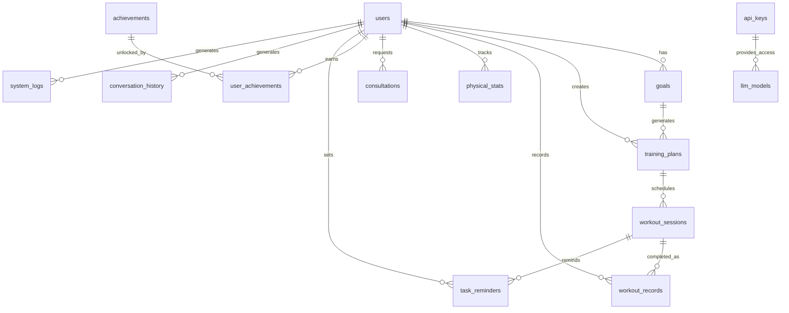
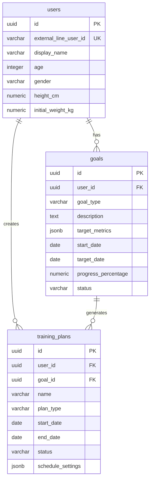
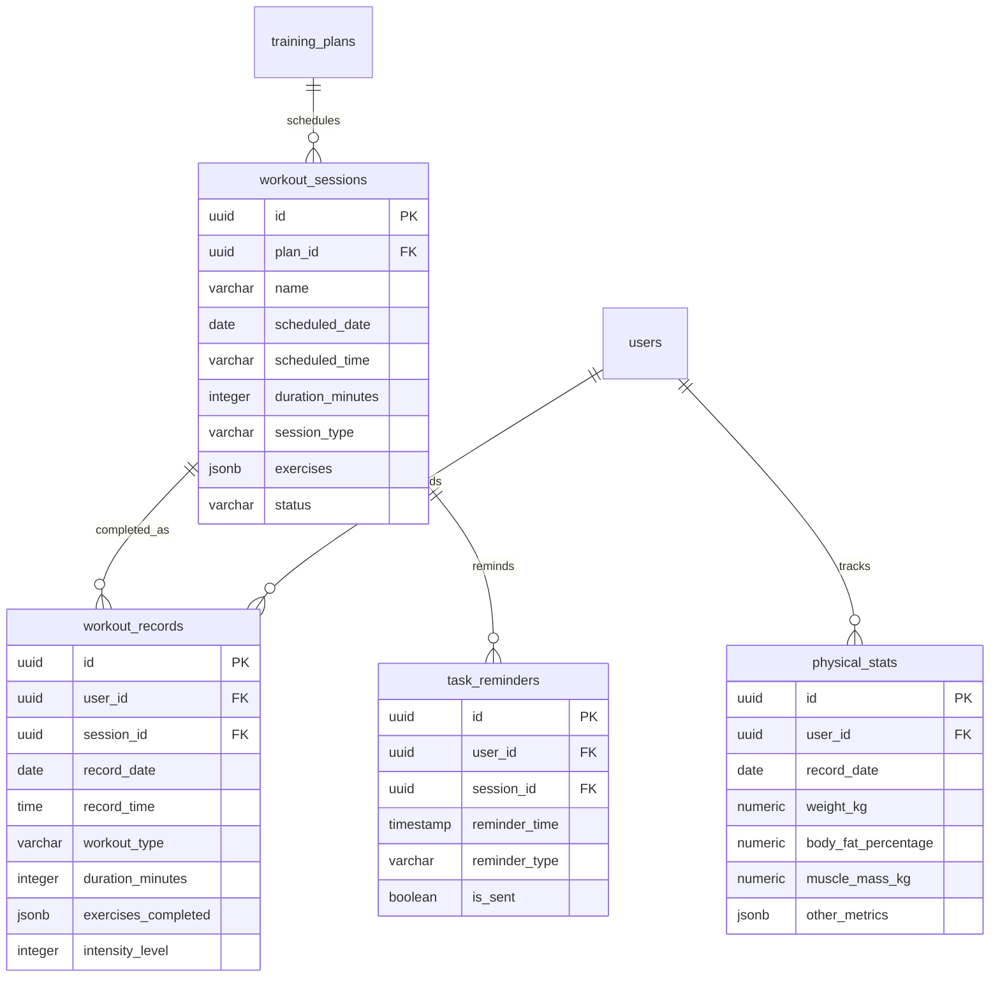
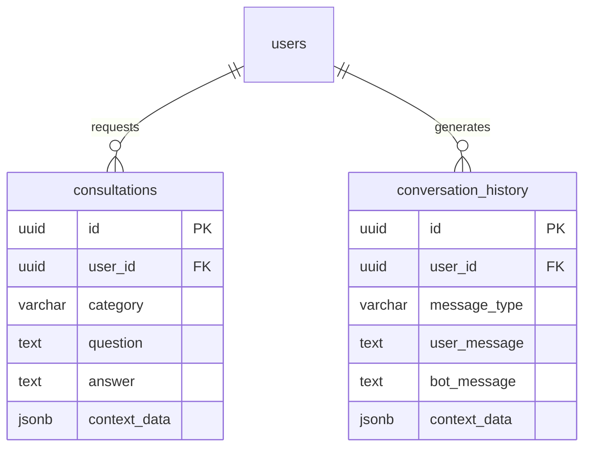
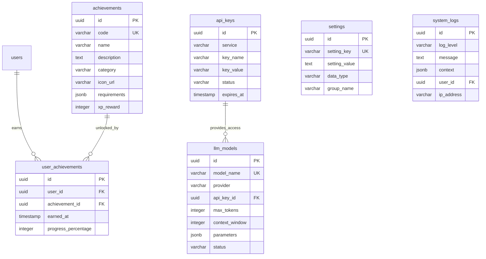

# テーブル間リレーションシップ

このドキュメントでは、LINEフィットネスBOTのデータベーステーブル間の関連性をER図で表現します。

## 全体リレーションシップ図

## 機能グループ別リレーションシップ

### 1. ユーザー・目標・トレーニング計画

### 2. トレーニング実行と記録

### 3. コミュニケーションと相談

### 4. アチーブメントとシステム

## 注意点

1. すべての外部キー制約は、親テーブルの削除時の挙動が定義されています（ON DELETE CASCADE または ON DELETE SET NULL）
2. 一部のテーブルは、1対多関係で複数のテーブルと関連付けられています
3. ユーザーテーブルはシステムの中心に位置し、多くのテーブルから参照されています
4. JSONB型カラムは複雑な構造データを保存するために使用されています

---

> **更新履歴**
> - 2024-04-11: 初版作成 