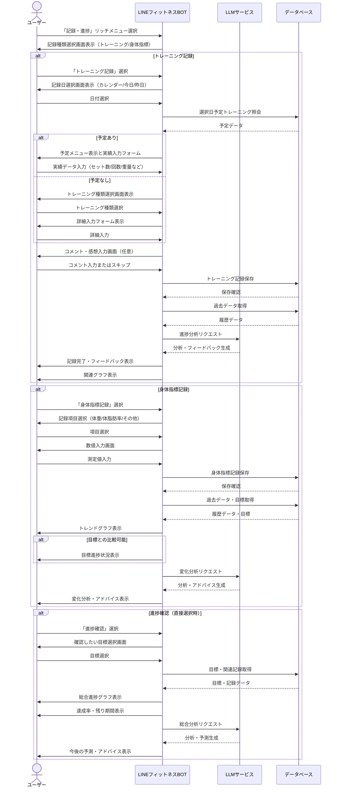
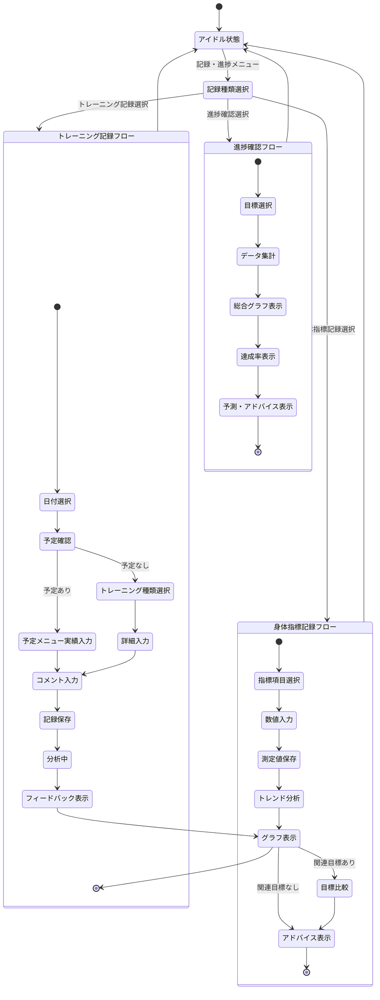

# 記録・進捗フロー

本ドキュメントでは、LINEフィットネスBOT における記録・進捗機能のユーザーフローと実装の詳細を定義します。

---

## 1. 機能概要
記録・進捗機能は、ユーザーがトレーニング実績や身体指標（体重・体脂肪率など）を記録し、時系列での変化を可視化することで、目標達成に向けた進捗を確認・モチベーションを維持するための機能です。グラフィカルな表示とAIによる分析フィードバックを通じて、効果的な継続を支援します。

---

## 2. ユーザーフロー図



---

## 3. 状態遷移図



---

## 4. 実装詳細

### 4.1 記録種類分類
| コード | 分類 | 説明 | 入力項目例 |
| --- | --- | --- | --- |
| workout | トレーニング記録 | トレーニング実施内容の記録 | メニュー、セット数、回数、重量 |
| weight | 体重記録 | 体重測定値の記録 | 体重(kg) |
| body_fat | 体脂肪率記録 | 体脂肪率測定値の記録 | 体脂肪率(%) |
| measurement | 体寸法記録 | 体の各部位寸法の記録 | 胸囲、腹囲、腕囲など(cm) |
| performance | パフォーマンス記録 | 運動能力指標の記録 | 走行距離、最大重量など |

### 4.2 メッセージテンプレート

#### 記録種類選択画面
```
記録・進捗メニューです。
以下から選択してください：

1. トレーニング記録
2. 身体指標記録（体重・体脂肪など）
3. 進捗確認
```

#### トレーニング記録画面例
```
4月11日のトレーニングを記録します。

【予定メニュー】
・筋力トレーニング（胸・肩・腕）
 - ベンチプレス: 3セット×10回
 - ショルダープレス: 3セット×12回
 - 腕立て伏せ: 3セット×15回

実績を入力してください：
ベンチプレス: [  ]セット×[  ]回 重量[  ]kg
ショルダープレス: [  ]セット×[  ]回 重量[  ]kg
腕立て伏せ: [  ]セット×[  ]回
```

#### 身体指標記録画面
```
本日の身体指標を記録します。
測定項目を選択してください：

1. 体重
2. 体脂肪率
3. 体寸法（胸囲/腹囲など）
4. その他の指標
```

#### 進捗グラフ例（体重）
```
【体重の推移】
過去4週間の体重変化です：

開始時: 70.0kg
現在: 67.5kg (-2.5kg)
目標: 65.0kg (あと2.5kg)

達成率: 50%
残り期間: 6週間

[グラフ表示]

このペースでは目標達成まであと6週間必要です。
トレーニングと食事を継続すれば、予定通り目標を達成できそうです！
```

### 4.3 LLMプロンプト例

#### トレーニング進捗分析プロンプト
```
以下のトレーニング記録データに基づいて、ユーザーの進捗を分析し、適切なフィードバックとアドバイスを提供してください。

【ユーザープロフィール】
- 性別: {{gender}}
- 年齢: {{age}}
- トレーニング目標: {{goal}}

【今回のトレーニング】
- 日付: {{date}}
- トレーニング種類: {{workout_type}}
- 実績詳細: {{performance_details}}
- ユーザーコメント: {{user_comment}}

【過去のトレーニング履歴】
{{training_history}}

以下の内容を含む分析を提供してください：
1. 進歩・改善点の特定
2. 前回からの変化と傾向
3. 具体的なアドバイス（最大3点）
4. モチベーションを維持するための励まし
```

#### 身体指標分析プロンプト
```
以下の身体指標データに基づいて、ユーザーの変化を分析し、適切なフィードバックとアドバイスを提供してください。

【ユーザー情報】
- 目標: {{goal_type}} - {{goal_details}}
- 開始値: {{start_value}} {{unit}}
- 目標値: {{target_value}} {{unit}}
- 期間: {{timeframe}}（残り {{remaining_days}} 日）

【測定履歴】
{{measurement_history}}

【最新データ】
- 日付: {{date}}
- 測定値: {{value}} {{unit}}
- 前回差分: {{difference}} {{unit}}

以下の内容を含む分析結果を提供してください：
1. 変化率の計算と評価
2. 目標達成予測
3. 現状に応じた具体的なアドバイス
4. ポジティブなフィードバック
```

### 4.4 データモデル

```typescript
interface WorkoutRecord {
  id: string;
  user_id: string;
  session_id?: string; // 紐づくWorkoutSessionのID（任意）
  record_date: Date;
  workout_type: string; // 'strength', 'cardio', 'flexibility' など
  duration_minutes: number;
  exercises_completed: {
    name: string;
    sets: number;
    reps: number | string;
    weight?: number;
    distance?: number;
    duration?: number;
    notes?: string;
  }[];
  intensity_level: number; // 1-10の主観的強度
  feedback?: string; // ユーザーのコメント・感想
  created_at: Date;
}

interface PhysicalStat {
  id: string;
  user_id: string;
  record_date: Date;
  category: string; // 'weight', 'body_fat', 'measurement', etc.
  value: number;
  unit: string; // 'kg', '%', 'cm', etc.
  notes?: string;
  created_at: Date;
}

interface ProgressSnapshot {
  user_id: string;
  goal_id: string;
  snapshot_date: Date;
  metrics: {
    metric_name: string;
    start_value: number;
    current_value: number;
    target_value: number;
    progress_percentage: number;
  }[];
  days_elapsed: number;
  days_remaining: number;
  prediction: {
    estimated_completion_date: Date;
    is_on_track: boolean;
  };
  created_at: Date;
}
```

### 4.5 グラフ表示オプション

| グラフタイプ | 用途 | 表示期間オプション |
| --- | --- | --- |
| 折れ線グラフ | 体重・体脂肪などの時系列変化 | 2週間/1ヶ月/3ヶ月/全期間 |
| 棒グラフ | トレーニング量（セット数×回数）比較 | 直近5回/週間比較/月間比較 |
| 円グラフ | トレーニング種類バランス分析 | 今週/今月/全期間 |
| ヒートマップ | 週間・月間トレーニング頻度可視化 | 1ヶ月/3ヶ月/6ヶ月 |
| レーダーチャート | 複数指標のバランス比較 | 開始時/現在/目標 |

---

## 5. バリデーション & 制約

- **入力範囲**: 各指標に対して生理学的に妥当な範囲を設定（例：体重0-300kg）
- **入力頻度**: 同一項目の記録は1日1回まで（上書き可）
- **グラフ表示**: 最低3ポイント以上のデータが必要
- **予測計算**: 最低2週間分のデータが必要
- **異常検知**: 前回から極端な変化（±10%以上）の場合は確認

---

## 6. アチーブメント & ガミフィケーション

目標達成へのモチベーション維持のため、以下のアチーブメントを実装:

| アチーブメント | 条件 | 報酬 |
| --- | --- | --- |
| 継続の達人 | 7日連続で記録 | 特別バッジ・励ましメッセージ |
| 目標達成者 | 設定目標を達成 | お祝いメッセージ・次のステップ提案 |
| 改善の証 | 特定指標で10%改善 | 分析レポート・共有機能解放 |
| マイルストーン | 記録回数50/100/500回達成 | 特別グラフ表示・統計情報 |

---

> **更新履歴**
> - 2024-04-11: 初版作成 