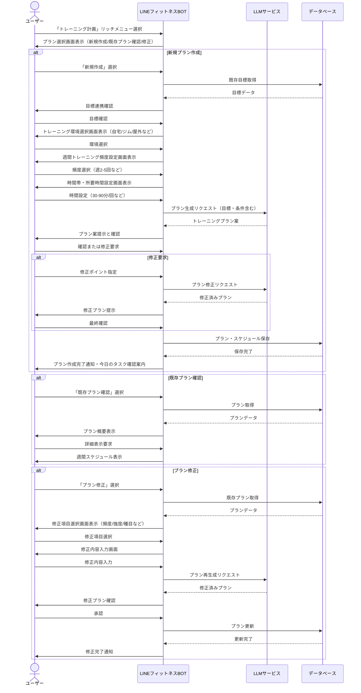
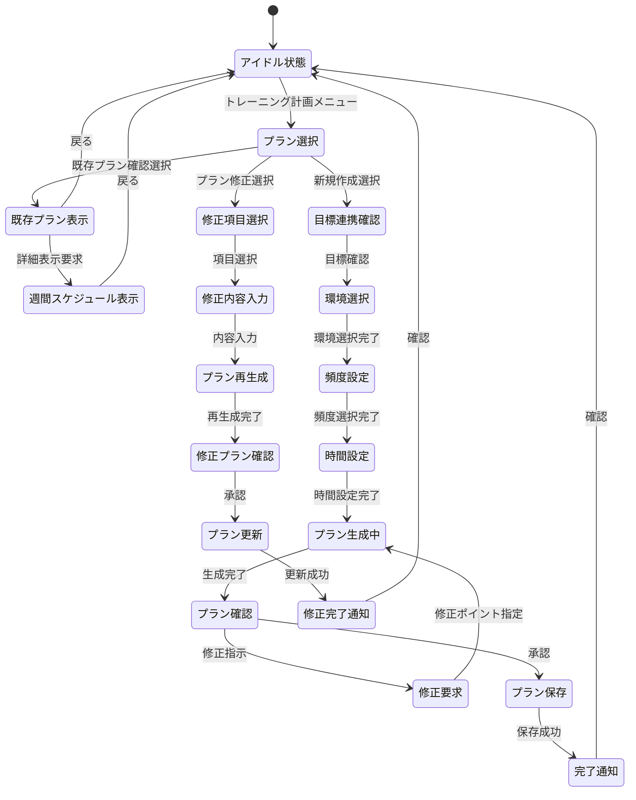

# トレーニング計画フロー

本ドキュメントでは、LINEフィットネスBOT におけるトレーニング計画機能のユーザーフローと実装の詳細を定義します。

---

## 1. 機能概要
トレーニング計画機能は、ユーザーの設定した目標に基づき、最適なトレーニングプランを自動生成し、カスタマイズ・スケジュール管理を行うものです。ユーザー特性（利用可能時間、環境、経験レベル）を考慮しながら、科学的根拠に基づいた効果的なプランを提供します。

---

## 2. ユーザーフロー図



---

## 3. 状態遷移図



---

## 4. 実装詳細

### 4.1 トレーニングタイプ分類
| コード | 分類 | 説明 | 例 |
| --- | --- | --- | --- |
| strength | 筋力トレーニング | 筋肉の強化と成長を促進 | ダンベルカール、ベンチプレス |
| cardio | 有酸素運動 | 心肺機能向上とカロリー消費 | ジョギング、サイクリング |
| flexibility | 柔軟性向上 | 可動域の拡大と怪我予防 | ストレッチ、ヨガ |
| balance | バランス強化 | 姿勢と安定性の向上 | バランスボード、片足立ち |
| hiit | 高強度インターバル | 短時間で効率的な脂肪燃焼 | タバタ式トレーニング |
| functional | 機能的トレーニング | 日常動作の改善と総合的強化 | スクワット、ランジ |

### 4.2 環境分類
| コード | 名称 | 説明 | 必要機材例 |
| --- | --- | --- | --- |
| home_minimal | 自宅（最小限） | 特別な機材なしで実施可能 | 自重、タオル、椅子など |
| home_basic | 自宅（基本装備） | 簡易な器具を使用 | ダンベル、マット、チューブ |
| gym | ジム | 各種専用マシン利用 | マシン、フリーウェイト |
| outdoor | 屋外 | 公園や広場で実施 | なし・ストリートファニチャー |

### 4.3 メッセージテンプレート

#### プラン選択画面
```
トレーニング計画メニューです。
以下から選択してください：

1. 新規プラン作成
2. 既存プラン確認
3. プラン修正
```

#### 環境選択画面
```
トレーニングを行う環境を教えてください：

1. 自宅（特別な器具なし）
2. 自宅（基本的な器具あり）
3. ジム
4. 屋外
```

#### 頻度・時間設定画面
```
週に何回トレーニングできますか？
【1回/2回/3回/4回/5回以上】

1回あたりの時間はどれくらい確保できますか？
【30分以内/30-60分/60-90分/90分以上】
```

#### プラン提案画面例
```
あなたの目標と条件に基づいた8週間のトレーニングプランです:

【目標】
・3ヶ月で体重を60kgから55kgに減らす

【週間スケジュール】
・月曜日: 筋力トレーニング（30分）
  - スクワット: 3セット×12回
  - プッシュアップ: 3セット×10回
  - プランク: 3セット×30秒

・水曜日: 有酸素運動（45分）
  - ウォーキング: 30分
  - インターバル走: 15分

・金曜日: 全身トレーニング（40分）
  - サーキットトレーニング（詳細省略）

このプランでよろしいですか？
【承認する/修正する】
```

### 4.4 LLMプロンプト例

#### トレーニングプラン生成プロンプト
```
あなたは経験豊富なパーソナルトレーナーです。以下の条件に基づいた8週間のトレーニングプランを作成してください。

【目標情報】
- 目標タイプ: {{goal_type}}
- 詳細: {{goal_description}}
- 開始値: {{start_metric}} {{unit}}
- 目標値: {{target_metric}} {{unit}}
- 期間: {{timeframe}}

【ユーザー情報】
- 性別: {{gender}}
- 年齢: {{age}}
- 身長: {{height}}cm
- 体重: {{weight}}kg
- トレーニング経験: {{experience_level}}

【制約条件】
- トレーニング環境: {{environment}}
- 週間頻度: {{weekly_frequency}}回
- 1回あたり時間: {{session_duration}}分
- 特記事項: {{special_notes}}

以下の形式で回答してください：
1. プラン概要（目標達成に向けた全体戦略）
2. 週間スケジュール（曜日ごとのトレーニング内容）
3. 各トレーニングの詳細（セット数、回数、強度等）
4. 週ごとの進行（強度・量の変化）
5. 注意点・アドバイス
```

#### プラン修正プロンプト
```
以下のトレーニングプランを、ユーザーのフィードバックに基づいて修正してください。

【現在のプラン】
{{current_plan}}

【ユーザーフィードバック】
{{user_feedback}}

【修正すべき点】
{{modification_points}}

修正したプラン全体を提示してください。修正箇所が明確にわかるようにしてください。
```

### 4.5 データモデル

```typescript
interface TrainingPlan {
  id: string;
  user_id: string;
  goal_id: string; // 関連付けられた目標ID
  name: string;
  description: string;
  environment: EnvironmentType; // 'home_minimal' | 'home_basic' | 'gym' | 'outdoor'
  start_date: Date;
  end_date: Date;
  status: 'active' | 'completed' | 'abandoned';
  schedule_settings: {
    frequency: number; // 週あたりの回数
    duration: number; // 1回あたりの分数
    preferred_days: string[]; // 曜日の配列 ['monday', 'wednesday', 'friday']
    preferred_time: string; // '朝' | '昼' | '夕方' | '夜'
  };
  created_at: Date;
  updated_at: Date;
}

interface WorkoutSession {
  id: string;
  plan_id: string;
  name: string;
  description: string;
  scheduled_date: Date;
  session_type: TrainingType; // 'strength' | 'cardio' | etc.
  duration_minutes: number;
  exercises: Exercise[];
  status: 'scheduled' | 'completed' | 'skipped';
  created_at: Date;
}

interface Exercise {
  name: string;
  description: string;
  sets: number;
  reps: number | string; // 数値または "30秒" などの文字列
  rest_seconds: number;
  notes: string;
}
```

---

## 5. バリデーション & 制約

- **頻度上限**: 初心者は週3回まで、中級者は週5回まで推奨
- **セッション時間**: 最短15分〜最長120分の範囲内
- **運動強度**: 年齢・経験に応じた適切な強度設定（RPE: 自覚的運動強度）
- **回復期間**: 同一筋群のトレーニングは48時間以上の間隔を空ける
- **漸進性**: 4-8週間かけて徐々に強度・量を増加させる
- **変化性**: 4週ごとにバリエーション変更を推奨
- **安全性**: リスクの高いエクササイズは経験者のみ提案

---

## 6. 拡張機能（将来）

- **AI動画解析**: トレーニングフォームのチェックとフィードバック
- **ウェアラブル連携**: 心拍数・消費カロリーに基づく強度最適化
- **プラン共有**: 友人と同じトレーニングプランの共有・比較
- **AI音声コーチング**: トレーニング中のリアルタイムガイド
- **栄養プラン連携**: トレーニング内容に合わせた食事プラン提案

---

> **更新履歴**
> - 2024-04-11: 初版作成